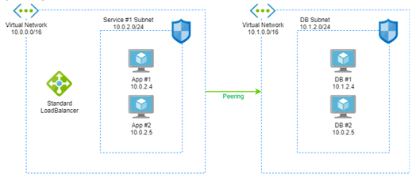
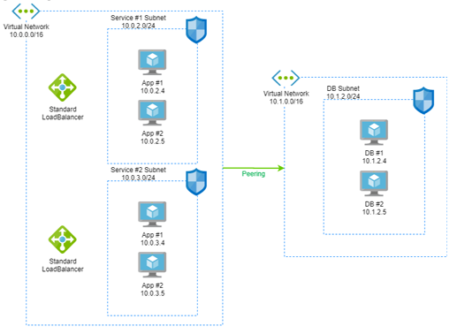
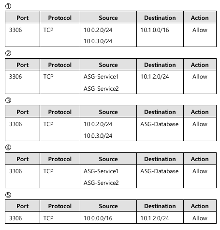
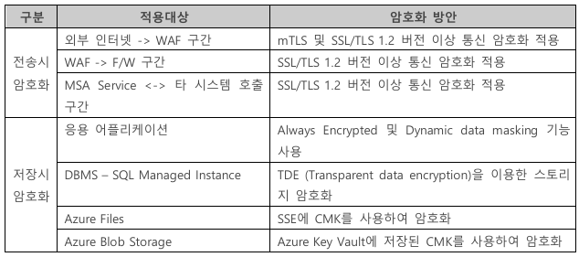
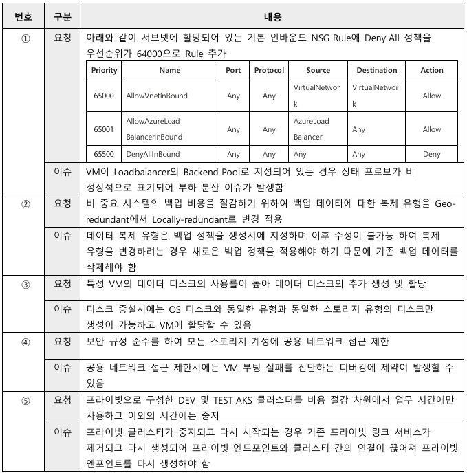

# CDS-Azure Pilot시험

[KICE 2025년 Pilot]


## 문항 1

A사는 Azure에 시스템을 구성하여 사용 중이다. 카카오사태로 인하여 DR시스템을 구축할 것을 권고 받아 DR을 구성하려고 한다. 현재 Korea Central Region을 사용 중에 있으며 DR의 경우 Korea South Region에 구성하려고 한다. 보기 중 적절하지 않은 것을 고르시오. [4점]

1. Korea South Region에 VNET를 생성한다.
2. Korea South Region에 현 Korea Central에 사용중인 모든 VM SKU가 DR에 사용가능한지 확인한다.
3. Korea South Region에 구성된 Azure DNS Private Resolver에 장애 상황을 대비하여 Korea Central Region에서 사용하는 도메인 정보를 추가한다.
4. Korea South Region에 On-Premise 데이터센터와 ExpressRoute를 구성한다.
5. Korea South Region에 사용하는 outbound용 public IP를 한정하기 위하여 Hub VNET에 NAT Gateway를 구성한다.

**(정답)** 3

**(해설)** Azure DNS Private Resolver는 Korea Central Region에서 제공하는 서비스로 Region 장애를 대비하여 Korea South Region에는 VM 기반의 DNS를 구성해야 한다.


### 추가해설

**1번** : DR 리전에 별도 VNet 생성 필요.

**2번** : 일부 VM SKU가 DR 리전에 없을 수 있으므로 가용성 확인 필수.

**3번** : 

* DR 리전의 **Private Resolver에 포워딩 규칙(rule set)을 추가**
* Private DNS Zone을 DR VNet에도 링크하여 장애 시 네임해결이 되도록 준비해야 함.
* Korea South Region에서는 Private Resolver가 지원되지 않음.
  * 만약 지원된다면...
    * **Korea Central, Korea South 양쪽에 Private Resolver 인스턴스를 각각 배포**
    * 자동동기화 기능은 없으므로 IaC 또는 자동화 스크립트로 직접 관리해야 함.
  * 지원되 않으므로 현재 대안은
    * Korea South 가 **지원하지 않아서 VM 기반 DNS를 써야 한다** → 현재 현실.

**4번 ** : Korea South Region에 ER Gateway를 구성하여 기존 Circuit과 연결하는 것으로 이해됨. 그렇다면 적절.

**5번**  : DR 환경에서도 **NAT Gateway**로 egress IP를 한정하는 것은 모범 사례입니다.


#### **Private DNS Zone 과 Private Resolver**

- **Azure Private DNS Zone = 이름 ↔ IP 매핑 저장소 (전역 리소스)**

- **Azure DNS Private Resolver = DNS 요청을 주고받는 Proxy (Region 리소스)**  onPrem 과 Azure사이 브리지 역할

- Azure DNS Private Zone

  - 전역리소스 이므로 모든 리전에서 해석가능

- Azure DNS Private Resolver

  * Azure DNS Private Resolver 는 Region 단위의 서비스임

  * 즉, Korea Center Region의 리소스(DNS) 는 다른 리전에서 사용할수 없음.

  * Private Resolver에 **다른 리전의 Private DNS Zone을 직접 추가하는 구조는 불가능**
    * DR을 위해서 필요한 것은 다른 리전의 도메인정보를 추가하는 것이 아니라 Vnet에 링크하는 방법으로 해결해야 한다.


#### ExpressRoute

* ExpressRoute Circuit 은 특정 Region(예: Korea Central) 에 생성되지만 다른 Region(예: Korea South) 의 ExpressRoute Gateway와도 연결이 가능함
* 그러므로 4번 보기는 아래와 같이 변경해야 좀 더 정확함
  * "Korea South Region에 ER Gateway를 구성하여 기존 Circuit과 연결한다."
  * 그렇지 않으면 "DR 용도로 Korea South Region에 ExpressRoute를 또 구성한다" 로 해석될 수 있다. 


## 문항 2

- 문제유형 : 단답형
- 출제영역 : Cloud Service Architecture > 요구사항기반 서비스구성요소 선정, 기반인프라 구축 및 운영
- 문제제목 : MSSQL PaaS 서비스의 제약사항 이해
- 출제의도 : MSSQL PaaS 서비스의 제약사항 이해 확인 

A사는 Azure로 인프라를 마이그레이션하려고 하며 그 중 Database는 대부분 MSSQL을 사용 중에 있다. Database 마이그레이션 관련되어 아래 고객의 요구사항이 있어 부합되는 Azure의 Database 서비스 및 기능을 선정하려고 한다. 보기의 내용 중 적절한 것을 선택하여 보기 번호를 답안에 작성하시오. [4점]

### [요구사항]

- Region은 Korea Central을 사용해야 한다.
- 주 Region인 Korea Central과 Pair Region인 Korea South에 Read Replica가 필요하다.
- DR 상황 시 Application들의 Endpoint 변경이 없는 단일 Endpoint가 가능해야 한다.
- Timezone 설정을 할 수 있어야 한다.
- DBLink를 사용할 수 있어야 한다.

### [보기]

```
[SQL서버 종류 및 Tier] 
가. Azure SQL DataBase General Purpose 
나. Azure SQL DataBase Business Critical 
다. Azure SQL Managed Instance General Purpose 
라. Azure SQL Managed Instance Business Critical
```


```
[고가용성 옵션] 
가. Active Geo-Replication 
나. Auto Failover Group 
```


**[답안]**

(1) SQL서버 종류 및 Tier 보기 선택:  ____
(2) 고가용성 옵션 보기 선택:  ____


**(정답)** 라, 나  

**(해설)** Azure SQL Managed Instance는 Active Geo-Replication 기능이 없음. 

Primary Region에 Read Replica는 기본 제공 HA를 구성하여 사용하고, Pair Region인 Korea South에 Read Replica가 필요하므로 Auto Failover Group으로 구성함.

 Azure SQL DataBase 는 DBLink를 사용할 수 없으며 Azure SQL Managed Instance는 가능하나 MSSQL만  가능, Timezone 은 Azure SQL Managed Instance 에서만 설정 가능하다.


### 추가설명

#### vCore 기반 모델 의 서비스계층

- **[범용(General Purpose)](https://www.google.com/search?sca_esv=893b81126e5e43ba&cs=0&q=범용(General+Purpose)&sa=X&ved=2ahUKEwjKl9Gro6CPAxUUf_UHHSw0HcAQxccNegQIOBAB&mstk=AUtExfDlTpf7hKpn1j48VRuLGI44G3ZE0E1YZTu-OJRxIQcjmZ2pKvIoeP8YsVuyhJusR_1dkJoFIoZ8nC2iMDW6pTnjyltP6KFAdupMIu4MT2M0qnteYASwhRKxuz6Rye2EtkZXa95V7GBTKHGYpaIgveTEytnK-LTqLcjodu4ipiJ8GoOOhMnYmlXYYtKXowZ-7xlA&csui=3):** 
  - 원격 SSD를 사용하며, 적절한 성능과 비용 효율성을 제공하여 다양한 범용 워크로드에 적합
- **[중요 비즈니스(Business Critical)](https://www.google.com/search?sca_esv=893b81126e5e43ba&cs=0&q=중요+비즈니스(Business+Critical)&sa=X&ved=2ahUKEwjKl9Gro6CPAxUUf_UHHSw0HcAQxccNegQIRxAB&mstk=AUtExfDlTpf7hKpn1j48VRuLGI44G3ZE0E1YZTu-OJRxIQcjmZ2pKvIoeP8YsVuyhJusR_1dkJoFIoZ8nC2iMDW6pTnjyltP6KFAdupMIu4MT2M0qnteYASwhRKxuz6Rye2EtkZXa95V7GBTKHGYpaIgveTEytnK-LTqLcjodu4ipiJ8GoOOhMnYmlXYYtKXowZ-7xlA&csui=3):** 
  - 로컬 SSD를 사용하여 높은 성능과 가용성을 제공, 한 개의 읽기 노드를 지원
- **[하이퍼스케일(Hyperscale)](https://www.google.com/search?sca_esv=893b81126e5e43ba&cs=0&q=하이퍼스케일(Hyperscale)&sa=X&ved=2ahUKEwjKl9Gro6CPAxUUf_UHHSw0HcAQxccNegQIQBAB&mstk=AUtExfDlTpf7hKpn1j48VRuLGI44G3ZE0E1YZTu-OJRxIQcjmZ2pKvIoeP8YsVuyhJusR_1dkJoFIoZ8nC2iMDW6pTnjyltP6KFAdupMIu4MT2M0qnteYASwhRKxuz6Rye2EtkZXa95V7GBTKHGYpaIgveTEytnK-LTqLcjodu4ipiJ8GoOOhMnYmlXYYtKXowZ-7xlA&csui=3):** 
  - 대용량 데이터베이스를 위한 계층으로, 기존의 단일 노드 리소스 제한을 제거
  - 파일 스냅샷을 통한 즉각적인 백업/복구가 가능

#### GP(**General Purpose**),  BC(**Business Critical**)

* **GP** 기본 HA 방식이 스토리지 복제 기반이라 Read Replica 제공하지 않음
  * HA 방식 = 스토리지 계층(3중 복제) 기반
  * DB 엔진은 단일 노드 → **Region 내 Read Replica 제공 불가**
* **BC**는 AlwaysOn AG 기반으로 Region 내 Read Replica를 제공
  - HA 방식 = AlwaysOn Availability Group 기반 (총 4개 노드)
  - Secondary 노드 중 일부를 **Read-only Replica**로 노출 가능
  - 앱에서 읽기 전용 부하를 Replica로 보내 성능 분산 가능


#### 요구사항 분석

- **Pair Region (Korea Central ↔ Korea South)에 Read Replica 필요**
  - Azure SQL Database Active Geo-Replication**(읽기 전용 복제본 제공) 또는**
  - **Auto-failover group**(주↔보조, 읽기/쓰기 및 읽기전용 엔드포인트 제공) 가능
- **DR 상황 시 Application Endpoint 변경 없음 (단일 Endpoint)**
  - Active Geo-Replication은 복제본에 연결하려면 연결 문자열을 변경해야 함
  - **Auto-failover group**은 단일 Listener Endpoint를 제공하여 앱 변경 불필요 ✅
- **Timezone 설정 가능해야 함**
  - Azure SQL Database는 Timezone 변경 불가 (UTC 고정)
  - **Azure SQL Managed Instance만 Timezone 변경 가능** ✅
- **DBLink 사용 가능해야 함**
  - Azure SQL Database는 Linked Server(DBLink) 불가
  - **Azure SQL Managed Instance는 DBLink 지원** ✅

- **주 Region에 Read Replica 필요**

  → GP는 **Region 내 Read Replica를 제공하지 않음**

  → BC는 **내부적으로 AG Secondary 노드에서 Read-only Replica 제공** ✅

- **Pair Region(Korea South)에 Read Replica 필요**

  → GP/BC 모두 Auto-failover group으로 가능


## 문항 3

* 문제유형 : 선다형
* 출제영역 : Cloud Service Architecture > 요구사항기반 서비스구성요소 선정, 기반인프라 구축 및 운영
* 문제제목 : Storage Account에 대한 리소스 구성 감사
* 출제의도 : 리소스의 변경관리를 할 수 있는 서비스 및 감사 설정에 대한 이해도 확인 

김선임은 C고객사의 시스템을 운영 중 Private 네트워크에서만 접근해야 하는 중요 파일 저장용 Storage Account에 퍼블릭 접근 권한을 실수로 부여하였다. 일주일 후 해당 조치가 문제가 있다는 것을 확인하여 퍼블릭 접근 권한을 회수 조치하였다. 추후 동일 이슈가 발생하지 않도록 변경사항에 대해 사전에 자동으로 모니터링될 수 있도록 방안을 수립하기로 하였다. 다음 중 적절하지 못한 것을 고르시오. [4점]

1. Azure Policy를 적용하여 퍼블릭 접근이 허용된 Storage Account에 대해 Audit Log를 남기고 알람을 발생시키도록 한다.
2. Azure Automation을 활용하여 주기적으로 퍼블릭 접근이 허용된 Storage Account을 확인하고 조치할 수 있도록 한다.
3. Azure CLI를 활용하여 Resource Graph에 질의하여 private endpoint가 구성되지 않은 Storage Account을 확인하고 수정할 수 있도록 한다.
4. Azure 활동 로그 이벤트를 수신할 수 있는 Event Grid와 Logic Apps를 활용하여 퍼블릭 접근 권한이 부여되는 Storage Account을 확인하고 수정할 수 있도록 한다.
5. Storage Account에 진단 설정을 활성화하여 익명 요청이 성공한 Storage Account을 확인하고 수정할 수 있도록 한다.

**(정답)** 3

**(해설)** Storage Account에서 private endpoint와 퍼블릭 접근 차단 설정은 별개의 설정이며, 각각 독립적으로 설정할 수 있으므로, private endpoint 구성 여부로 퍼블릭 접근 가능 여부를 판별할 수 없다.


### 추가해설

**1. Azure Policy + Audit Log + 알람**

- Azure Policy에는 **“Storage account public network access should be disallowed”** 같은 Built-in 정책이 있음.
- 이 정책을 **Audit** 또는 **Deny** 모드로 걸 수 있고, **Azure Monitor와 연동해서 알람**도 가능.

**2. Azure Automation으로 주기적 검사 및 조치**

- Runbook을 작성해 주기적으로 Storage Account 설정을 확인하고, 퍼블릭 접근 시 자동 수정 가능.
- 모니터링/조치 방안으로 적절.

**3. Azure CLI + Resource Graph 쿼리 + 자동 수정**

- Resource Graph는 **속성 조회** 용도로 사용되며, CLI/Query로 퍼블릭 접근 여부는 확인 가능.
- 하지만 **Resource Graph는 읽기 전용 서비스**라서 직접 **수정은 불가** 
- “확인 및 수정”까지 가능하다고 한 부분이 잘못됨.

**4. Event Grid + Logic Apps**

- Activity Log 이벤트를 Event Grid로 받아 Logic App에서 “퍼블릭 접근 설정 변경 이벤트 발생 시 자동 조치” 가능.
- 완전히 적절한 방안.

**5. Diagnostic Setting + 로그 기반 모니터링**

- 진단 로그를 켜면 **익명 요청 성공 여부**를 추적 가능.
- 이걸 기반으로 모니터링 및 대응 가능.


## 문항 4

* 문제유형 : 선다형
* 출제영역 : Cloud Service Architecture > 시스템 비기능요건(성능, 가용성, 확장성, 비용최적화)을 반영한 구축 및  운영
* 문제제목 : Azure 가용성에 대한 이해
* 출제의도 : Azure 리소스 가용성에 대한 이해

A사는 차세대 프로젝트를 위해 Azure Public Cloud를 선정하였으며 금융권 Cloud 보안 요건 중 데이터센터 가용성 항목에 대응하기 위해서 Azure의 Availability Zone 기능 검토를 확인 중에 있다. 다음 내용 중 올바른 것을 고르시오. [4점]

1. VM의 경우 Availability Zone 내 Availability Set을 함께 구성하여 VM 가용성을 극대화할 수 있다.
2. Standard Load Balancer는 Frontend-ip를 Availability Zone 분산, Availability Zone 지정을 할 수 있으며 Zone 지정을 할 경우 Back-End VM들의 Zone과 동일하지 않아도 LB를 통한 통신을 할 수 있다.
3. Multi Subscription을 사용할 경우 각 Subscription의 Availability Zone Number는 동일한 데이터센터를 의미한다.
4. Azure Virtual Network은 Availability Zone을 사용하기 위하여 Zone별로 Subnet을 생성해야만 한다.
5. Azure VPN Gateway는 Availability Zone 분산(Zone Redundant)을 제공하지 않으므로 2개의 Zone을 사용하도록 각각의 VPN Gateway를 구성한다.

**(정답)** 2 

**(해설)** 

1) VM의 경우 AZ을 지정하면 AS을 사용자가 지정할 수 없다. 

2) 정답
3) Subscription 내의 Zone1, 2, 3 이 물리적 Datacenter 를 의미하는 것이 아니고 논리 적인 것이므로 Subscription당  물리적 Datacenter와 Zone 1, 2, 3 이 서로 다를 수 있다.  
4) VNET 은 Zone Redundant서비스 이므로 Zone사용을 위해 별도로 존을 정의할 수 없고 자동으로 Zone으로  확장된다.  
5) Azure VPN Gateway 는 Zone-redundant 를 지원하는 SKU가 있으므로 해당 SKU를 사용하게 되면 2개의 Zone에  자동으로 2대의 Instance가 배포된다.  


### 추가해설

**1. VM의 경우 Availability Zone 내 Availability Set을 함께 구성하여 VM 가용성을 극대화할 수 있다.**

- ❌ 틀림.
- VM은 **Availability Zone**과 **Availability Set**을 동시에 지정할 수 없음.
- 둘은 배타적인 옵션이며, VM 생성 시 둘 중 하나만 선택 가능.

**2. Standard Load Balancer는 Frontend-IP를 Availability Zone 분산, Availability Zone 지정 가능하며 Zone 지정을 할 경우 Back-End VM들의 Zone과 동일하지 않아도 LB를 통한 통신을 할 수 있다.**

- ✅ 맞는 설명.
- **Standard Load Balancer**는 3가지 모드 지원:
  - Zone-redundant (Zonal 분산)
  - Zonal (특정 Zone 지정)
  - Regional
- Zonal Frontend를 사용하더라도 Backend VM은 다른 Zone에 있어도 정상적으로 LB 트래픽을 처리할 수 있음.


**3. Multi Subscription을 사용할 경우 각 Subscription의 Availability Zone Number는 동일한 데이터센터를 의미한다.**

- ❌ 틀림.
- AZ 번호는 **구독/리소스 그룹마다 매핑이 다를 수 있음**.
- 예: Subscription A의 Zone 1 ≠ Subscription B의 Zone 1 (동일 Zone 번호라도 실제 물리 Zone 다를 수 있음).
- Microsoft도 공식적으로 “Zone 번호는 Subscription 간 일관되지 않다”고 명시.


**4. Azure Virtual Network은 Availability Zone을 사용하기 위하여 Zone별로 Subnet을 생성해야만 한다.**

- ❌ 틀림.
- Subnet은 Zone에 종속되지 않음.
- VNet/Subnet은 Region 단위 리소스이며, **Zone과 무관하게 공유 가능**.
- VM 배치할 때 Zone을 지정할 뿐, Subnet은 Zone 단위로 나눌 필요 없음.


**5. Azure VPN Gateway는 Availability Zone 분산(Zone Redundant)을 제공하지 않으므로 2개의 Zone을 사용하도록 각각의 VPN Gateway를 구성한다.**

- ❌ 틀림.
- VPN Gateway는 **Zone-redundant SKU**를 제공.
- Zone Redundant Gateway 선택 시 여러 Zone에 걸쳐 자동 배치 가능.


#### AvailabilitySet vs AvailabilityZone

Azure의 **Availability Set**과 **Availability Zone**은 모두 **VM 가용성(Availability)**을 높이기 위한 기능이지만, 사용 방식과 보장 수준, 인프라 구성 방식이 다르다.

| 항목                 | **Availability Set**                      | **Availability Zone**                         |
| -------------------- | ----------------------------------------- | --------------------------------------------- |
| **가용성 수준**      | 고가용성(HA, 약 99.95%)                   | 매우 높은 고가용성 (ZRS, 약 99.99%)           |
| **물리적 위치 분산** | 동일 데이터센터 내에서 분산 (FD, UD 기반) | 서로 다른 데이터센터(Zone) 간 분산            |
| **배포 대상**        | VM 전용 (Classic 또는 ARM)                | VM, Disk, IP, LB 등 다양한 리소스             |
| **기반 기술**        | Fault Domain / Update Domain              | 물리적으로 분리된 Zone                        |
| **재해 복구 효과**   | 제한적 (전원, 네트워크 일부 실패 방지)    | **지진/화재 등 지역 단위 장애에도 복구 가능** |
| **네트워크 지연**    | 최소 (동일 데이터센터)                    | 약간 존재 (Zone 간 통신)                      |
| **VM 생성 시**       | Availability Set 지정                     | **Zone 번호 (1,2,3 등) 지정**                 |
| **변경 가능 여부**   | VM 생성 후 변경 불가                      | VM 생성 후 변경 불가                          |
| **주요 사용 사례**   | 기존 시스템, 단순 HA 필요 시              | 금융, 게임, 실시간 시스템 등 높은 SLA 요구 시 |

##### 1. Availability Zone (AZ)

- **물리적으로 분리된 데이터센터 단위** (전력, 냉각, 네트워크가 독립적)
- 동일 Region 내 최소 3개 Zone 제공
- VM을 배치할 때 Zone을 지정하면 **Zone 단위 장애에도 서비스 지속 가능**
- SLA: 99.99% (2개 이상 Zone에 VM 배치 시)

##### 2. Availability Set (AS)

- 단일 데이터센터(Zone) 내에서 **VM을 Fault Domain(FD), Update Domain(UD) 단위로 분산 배치**
- FD: 전원/네트워크 공유 단위 (물리적 장애 분산)
- UD: 패치나 업데이트 시 한 번에 재부팅되는 단위 (계획된 장애 분산)
- SLA: 99.95% (2개 이상 VM을 Availability Set에 넣을 때)

##### 3. AZ vs. AS 관계

- **Availability Zone** = “데이터센터 단위 장애 대응”

- **Availability Set** = “데이터센터 내부 장애/업데이트 대응”

- 둘은 **서로 배타적**임.

  - VM을 만들 때 **Zone에 배치**할지, **Set에 배치**할지를 선택해야 함.
  - **동시에 둘 다 설정 불가** 

  


## 문항 5

* 문제유형 : 선다형
* 출제영역 : Cloud Service Architecture> 시스템 비기능요건(성능, 가용성, 확장성, 비용최적화)을 반영한 구축 및  운영
* 문제제목 : SAS를 사용한 Azure Blob Storage 구성  Secret
* 출제의도 : 비용과 성능 효율적인 스토리지 아키텍처 설계 

B사는 VM 기반 WEB / WAS 서버를 이중화 구성하였고, 대용량 파일(동영상 파일 또는 데이터 분석을 위한 로우 파일)의 저장을 위해 Azure Files를 공유 볼륨으로 구성하여 VM에 Mount하였다. 처리하는 파일 개수가 증가함에 따라 응답시간에 대한 지연이 발생하였고, 원인 분석 결과는 많은 대용량 파일의 업로드 / 다운로드로 인한 WAS 서버의 리소스 사용량이 증가였다. Azure Files의 성능 지표에서는 요청에 대한 응답 병목은 발생하지 않았다. WAS 서버의 리소스 사용량 감소를 위한 방안으로 보안을 최대한 준수하면서도 비용 효율적인 방법을 고르시오. [4점]

1. WAS에 클라이언트 인증 서비스를 구성하여 인증된 클라이언트에게 Azure Files의 Access Key를 제공하여 직접 접근하여 사용하도록 한다.
2. WAS에 클라이언트 인증 서비스를 구성하여 인증된 클라이언트에게 Azure Files의 SAS (Shared access signature)를 제공하여 클라이언트에서 직접 접근하여 사용하도록 한다.
3. Azure Shared Disk를 생성하여 VM에 할당하여 사용한다.
4. WAS에 클라이언트 인증 서비스를 구성하여 인증된 클라이언트에게 Azure Blob Storage의 SAS (Shared access signature)를 제공하여 클라이언트에서 직접 접근하여 사용하도록 한다.
5. 대용량 파일 업로드/다운로드용 Azure Function을 추가로 생성하여 사용한다.


**(정답)** 4

**(해설)** 한번만 기록하고 시퀀스 액세스로 파일을 사용하는 워크로드의 경우 Azure Files보다 Azure Blob Storage가 더 최적화되어 있다. 또한, 인증된 클라이언트에 SAS를 제공하여 필요한 최소한의 권한 및 유효 기간 부여가 가능하다.

```
1) Access Key는 구성과 데이터에 대한 권한을 부여하는데 사용 가능하기 때문에 보안상 문제가 발생할 수 있다.  
2) Azure Files 는 랜덤 액세스 파일에 더 적합하며 동영상 파일 혹은 데이터 분석을 위한 로우 파일 저장 및 읽기에는 Blob Storage가 더 적합하며 비용 효율적이다.
3) Azure Shared Disk 를 공유 볼륨으로 사용하려는 경우 별도의 구성이 필요하며 Azure Blob Storage 대비 비용이 비싸다.
5) Azure Function을 사용하여 대용량 파일을 처리하는 경우 처리시간이 기본 15분, 최대 60분으로 (Azure  Function 의 호스팅 옵션에 따라 다르나 추가비용 발생) 제약을 받을 수 있으며 
   처리할 수 있는 요청도 기본  100MB(처리량 증가 시 호스팅 옵션 설정 필요하나 비용 증가 및 비용효율성이 낮음)로 설정되어 있어 적합하지 않다.
```


### 추가해설

* **SAS (Shared Access Signature)**는 일정 시간 동안 특정 리소스(Azure Files 포함)에 대한 **세분화된 권한을 부여**할 수 있는 방식.
* **클라이언트가 WAS를 거치지 않고, Azure Files에 직접 접근 가능** → WAS의 리소스 사용량 급감
* WAS는 여전히 **접근 제어의 중심이 되므로 보안 요건 충족 가능**
* **Access Key를 직접 노출하는 것보다 훨씬 안전**하며, **Azure Files에 SAS를 발급하는 구조는 정식 지원됨**
* 비용도 별도 컴퓨팅 리소스를 사용하지 않으므로 **비용 효율적**


#### **Azure Files vs. Azure Blob Storage**

| **구분**      | **Azure Files**                | **Azure Blob Storage**           |
| ------------- | ------------------------------ | -------------------------------- |
| 스토리지 모델 | 파일 스토리지 (SMB/NFS)        | 오브젝트 스토리지 (REST API)     |
| 구조          | 공유(Share) → 디렉토리 → 파일  | 컨테이너(Container) → Blob       |
| 접근 방식     | SMB/NFS, 네트워크 드라이브     | REST API, SDK, CLI               |
| 인증          | AD/Entra ID, SAS, Key          | SAS, Key, RBAC                   |
| 시나리오      | 파일 서버 대체, 공유 저장소    | 정적 콘텐츠, 로그, 데이터 레이크 |
| 계층화        | Standard/Premium (디스크 성능) | Hot/Cool/Archive (수명주기 기반) |


## 문항 6

* 문제유형 : 선다형
* 출제영역 : Cloud Service Architecture> 시스템 비기능요건(성능, 가용성, 확장성, 비용최적화)을 반영한 구축 및  운영  Secret
* 문제 제목: Load balancer 구성 항목 중 Health probe의 이해
* 출제 의도: Load balancer 구성 항목 중 Health probe의 이해 여부 확인 

VM 기반으로 구축된 웹 서비스를 운영하고 있다. 해당 서비스는 Azure Load Balancer로 이중화 구성이 되어 있다. 서비스에 장애가 발생하여 VM 서버 확인 결과 모든 서버에서 서비스 Port를 정상적으로 Listen 하고 있었다. 하지만 한 대의 서버에서 WAS가 Hang이 걸려 요청을 처리하지 못하는 상태임에도 불구하고 Azure Load Balancer는 요청을 장애가 발생한 서버로 전달하고 있다. 다음 제시된 보기 중 장애가 발생한 VM으로 트래픽 전달을 방지하기 위한 Azure Load Balancer 설정 중 변경해야 하는 항목과 내용이 올바른 것을 고르시오. [4점]

1. Health probe 설정에서 프로토콜 항목이 TCP인 경우 HTTP나 HTTPS로 변경 후 웹 서비스의 동작 확인 가능한 경로를 추가로 설정한다.
2. Load balancing rule 설정에서 Session persistence 설정이 되어 있는 경우 None으로 변경한다.
3. Health probe 설정에서 서비스의 비정상적인 상태를 빠르게 인지하기 위하여 확인 주기를 최소 주기로 설정한다.
4. Health probe 설정에서 프로토콜 항목이 HTTP나 HTTPS인 경우 정상 응답 HTTP 상태 코드 범위를 변경한다.
5. Load balancing rule 설정에서 Idle timeout 값을 10 이하로 변경한다.


**(정답)** 1

**(해설)** TCP로 상태를 모니터링하는 경우 웹 서비스의 비정상적인 동작 감지가 되지 않는다. TCP의 경우 단순 TCP 핸드셰이크 여부만을 체크한다.

```
1) Azure Load Balancer 로 웹 서비스의 상태를 모니터링 하기 위하여 프로토콜을 HTTP 또는 HTTPS로 설정하는 
경우 상태 체크를 위한 요청에 대한 HTTP 응답 코드가 200 (OK)으로 고정되어 있어 다른 HTTP 응답 코드 403 
(Forbidden), 500 (Internal Server Error ) 등이 반환되는 경우 오류 상태로 인지한다. 

2) Session persistence 설정은 동일한 클라이언트에서 발생한 요청을 동일한 VM에서 처리하도록 지정하는 옵션이며 
해당 설정을 변경한다고 하여도 일부 요청은 기존과 동일하게 장애가 발생한 서버로 전달된다. 

3) 상태 체크 확인 주기를 변경한다고 하여도 VM 서버가 서비스 Port를 정상적으로 Listen하고 있기 때문에 기존과 
동일하게 장애가 발생 서버로 요청이 전달된다. 

4) Azure Load Balance 의 경우 정상 응답 HTTP 상태 코드의 범위를 지정하는 옵션이 존재 하지 않는다. 해당 옵션은 
Application Gateway 에서 제공한다. 

5) Idle timeout 값은 Azure Load Balance 에 연결된 클라이언트가 요청없이 일정 시간이 경과하는 경우 자동으로 
연결을 종료하는 기능이다.
```


### 추가해설

* TCP 는 Port 오픈정도만 확인한다.  그러므로 웹서비스의 정확한 상태를 체크하기 위해서는 http 프로토콜을 이용해야 한다. 


## 문항 7

K 책임은 G 고객사의 클라우드 MSP를 수행하는 담당자이다. 디스크 변경 작업을 검토한 내용 중 잘못 설명된 보기를 고르시오. [3점]

1. VM에 데이터 디스크를 추가로 attach하기 위해서는 VM을 중지시키지 않고 구성이 가능하기 때문에 별도의 서비스 중단 시간을 고려하지 않고 작업을 진행할 수 있다.
2. 데이터 디스크를 동일한 유형의 더 큰 사이즈로 resize 하는 경우 VM을 중지시키지 않고 작업이 가능하여 별도의 서비스 중단 시간을 고려하지 않고 작업을 진행할 수 있다.
3. 데이터 디스크가 공유 디스크로 다수의 VM에 할당된 경우 사이즈 조정을 위해서는 모든 VM에서 detach 이후 진행을 해야 하기 때문에 서비스 중단 시간을 확보한 이후 작업을 진행할 수 있다.
4. VM에 attach되었지만 볼륨을 구성하지 않았던 데이터 디스크에 대한 삭제 요청 시에는 VM을 중지시키지 않고 detach가 가능하기 때문에 별도의 서비스 중단 시간을 고려하지 않고 작업을 진행할 수 있다.
5. 할당된 데이터 디스크의 사이즈의 축소를 요청하는 경우 용량 문제가 없다면 해당 데이터 디스크에서 직접 용량을 줄일 수 있으므로 서비스 중단 시간을 고려하지 않고 작업을 진행할 수 있다.


**(정답)** 5

**(해설)** 데이터 디스크의 사이즈를 직접 줄일 수 없다. 데이터 디스크의 사이즈를 축소하고자 하는 경우 신규 디스크를 추가한 후 기존 데이터를 신규 디스크에 복제 후 기존 데이터 디스크를 삭제하는 방식(마이그레이션)을 통해 진행해야 한다.    이 과정에서 서비스 중단이 필요할 수 있음


### 추가해설

**1. VM에 데이터 디스크를 추가로 attach → VM 중지 필요 없음**

- Azure VM은 **실행 중인 상태에서 데이터 디스크 attach/detach 가능**.

**2. 데이터 디스크 resize (더 큰 사이즈로 확장) → VM 중지 필요 없음**

- Azure Managed Disk는 **온라인 상태에서 크기 확장 가능**.  단, OS 내부 파일시스템 확장은 OS 명령어로 별도 처리해야 함.

**3. 공유 디스크(Shared Disk) → 다수 VM에 할당 시 resize**

- 공유 디스크는 HA Cluster용으로 사용되며, 크기 변경 시 **모든 VM에서 detach 후 작업 필요**.     서비스 중단 고려 필수.

**4. attach 되었지만 볼륨으로 구성하지 않은 데이터 디스크 삭제 요청 → VM 중지 필요 없음**

- 단순 attach 상태라도 detach 후 삭제 가능, VM 중지 필요 없음.

**5. 데이터 디스크 사이즈 축소(shrink)**

- Azure Managed Disk는 크기 축소 불가능.   오직 확장만 가능. 축소하려면 새 디스크를 생성 후 데이터를 마이그레이션해야 함.


## 문항 8

Azure Public 클라우드와 On-premise간 전용선 연결 구성을 하려고 한다. 보기의 전용선 구축 전 고려해야 할 내용중 적절하지 않은 것을 고르시오. [4점]

1. Korea Central Region의 Azure ExpressRoute Circuit(Premium SKU)을 Japan EAST Region에 있는 구축된 Express Route Gateway와 연결 후 On-Premise와 Japan EAST Region의 VNET 간의 통신이 가능하다.
2. Korea Central Region의 Azure ExpressRoute Circuit(Standard SKU)을 Korea South Region에 있는 Express Route Gateway와 연결 후 On-Premise와 South Region의 VNET 간의 통신이 가능하다.
3. Korea Central Region의 Azure ExpressRoute Circuit과 연결된 On-Premise와 Korea South Region의 Azure ExpressRoute Circuit과 연결된 On-Premise는 서로 통신이 가능하므로 On-Premise 간 통신을 위해 별도의 전용회선 연결이 불필요하다.
4. Azure Express Route Circuit Private Peering과 Express Route Gateway 간에는 QoS 설정 기능이 없기 때문에 ExpressRoute Gateway에 여러 개의 VNET이 Peering되어 연결된 경우 하나의 VNET에서 전용선 대역폭을 모두 사용하여 다른 VNET에 영향을 끼치지 않도록 설계 시 고려가 필요하다.
5. Azure Express Route Circuit과 Azure Express Route Gateway를 통해 두 개의 VNET이 연결되어 있는 경우 Express Route Circuit 자체의 라우팅 기능을 통해 VNET 간 직접 통신이 가능하다.

**(정답)** 3

**(해설)** Circuit 만으로는 불가능하며 Global Reach를 추가 구성하여 사용해야 가능하다.


### 추가해설

* 1. Premium SKU를 통해 Region 간 통신 가능

  - **ExpressRoute Premium SKU**는 **Global Reach** 기능을 통해 다른 Region(VNET)과 통신 가능
  - 예: Korea Central에 만든 회선을 Japan East의 VNET과 연결 가능

* 2. Standard SKU는 같은 지역 내 VNET 연결만 가능

  - Standard SKU는 **회선과 동일한 지역의 VNET과만 연결** 가능
  - Korea Central의 ExpressRoute(Standard)는 **Korea South Region VNET과 연결 불가**

  * 그래서 보기 2는 정확히 “Standard SKU로는 Region 간 연결 불가”를 암시하고 있어 **맞는 설명**

* **3. Global Reach로 On-Prem ↔ On-Prem 통신 가능**

  - **Global Reach** 기능을 사용하면 **ExpressRoute Circuit 간 On-Prem 연결**이 가능합니다

  - 즉, 서로 다른 지역에 ExpressRoute 연결된 On-Prem 환경 간의 전용선 통신이 가능하며,

    **별도 MPLS 회선 없이도 연결 가능**

  * 적절한 설명입니다.

* 4. QoS 설정 기능 없음 → 설계 시 고려 필요

  * ExpressRoute Gateway 자체에는 **QoS 기능이 없기 때문에**
  * 여러 VNET이 Gateway를 공유하는 경우 특정 VNET이 대역폭을 몰빵하면
  * 다른 VNET에 영향을 줄 수 있음 따라서 이러한 구조일 경우 **대역폭 관리 및 분리 설계 고려 필요**

* ExpressRoute Gateway는 **On-Prem ↔ VNET 간 통신**을 위한 구성요소임

  * **ExpressRoute Circuit을 통해 연결된 두 VNET 간에는 자동으로 통신되지 않습니다.**

  * VNET 간 통신은 별도로 VNet Peering**을 설정해야 하며, ExpressRoute Circuit이 **VNET 간 라우팅을 제공하지는 않습니다.**

  * 즉, **VNET ↔ On-Prem ↔ VNET 통신은 가능하지만**,

    **VNET ↔ VNET 간 직접 통신은 불가능하며 ExpressRoute만으로 라우팅되지 않습니다.**


- [Microsoft Docs – ExpressRoute Global Reach](https://learn.microsoft.com/ko-kr/azure/expressroute/expressroute-global-reach)
- [Microsoft Docs – ExpressRoute 개요](https://learn.microsoft.com/ko-kr/azure/expressroute/expressroute-introduction)


## 문항 9

B 사의 김선임은 Kubernetes 기반으로 구축된 홈쇼핑 서비스를 운영하고 있다. 조회용 API 서비스 로그를 확인해보니 간헐적으로 에러가 발생하였으며 원인을 추적한 결과 서비스의 기능 개선 및 오류 수정을 위한 배포 시 POD 시작/종료 시점에 에러가 발생하고 있었다. 조치사항으로 잘못된 것을 고르시오. [4점]

1. POD 종료 시 에러는 PreStop Hook를 설정하여 Graceful ShutDown을 통해 해결한다.
2. ReadinessProbe의 설정을 조정하여 서비스가 정상 기동 후에 K8S Service에 등록되도록 한다.
3. StartUpProbe를 활용하여 LivenessProbe와 ReadinessProbe가 서비스가 정상 기동 후에 동작하도록 한다.
4. Ingress 컨트롤러에서 Internal Error(500) 오류 발생 시 Retry를 적용하여 End-User 에러 발생 빈도를 현저히 감소시킬 수 있다.
5. Service Mesh를 사용하고 에러가 발생하는 서버에서 다른 Micro Service Pod의 조회 API를 호출하는 경우 Circuit Breaker의 Retry 설정을 확인하여 다른 Micro Service 배포 시 발생할 수 있는 에러를 줄일 수 있다.

**(정답)** 4

**(해설)** (4) Internal Error의 경우 Application 자체에 문제가 있는 경우이며, Retry로 해결되지 않는다. Bad Gateway의 경우에는 Retry로 개선이 가능할 수 있다.


### 추가해설

**1. PreStop Hook을 통한 Graceful Shutdown**

- **PreStop Hook**을 사용하면, Pod 종료 전에 지정된 작업(예: 연결 종료, 세션 저장 등)을 실행할 수 있어,
- 서비스가 **갑자기 종료되지 않고 정상적으로 내려가도록 제어** 가능함.
- Pod 종료 시 에러 방지에 매우 효과적임.

**2. Readiness Probe로 서비스 등록 지연 제어**

- Readiness Probe는 **Pod이 기동 중이라도, 준비되지 않은 상태에서는 서비스 대상에서 제외**시켜 줌.
- 따라서 기동 도중 에러 응답을 방지할 수 있음 → 매우 중요한 설정

**3. StartUp Probe로 초기 기동 안정성 확보**

- **StartUpProbe**는 컨테이너의 초기 구동이 느린 경우에 LivenessProbe/ReadinessProbe의 조기 실패를 막기 위해 사용

- 즉, **컨테이너가 완전히 기동될 때까지 Liveness/Readiness를 뒤로 미루는 역할** 수행
- 특히 WAS가 느리게 뜨는 경우 매우 유용

**4. Ingress 컨트롤러 Retry**

- Ingress Controller(NGINX Ingress 등)는 502/504와 같은 게이트웨이 오류에 대해 retry 옵션을 둘 수는 있다.
- 하지만 **500 Internal Server Error는 애플리케이션 내부 오류**이므로, Ingress 레벨에서 단순히 retry한다고 해결되는 문제가 아님

**5. Service Mesh에서 Retry/Circuit Breaker 조정**

- Service Mesh를 사용하는 경우, **서버 간 호출 시 Retry 정책**은 Mesh 레벨에서 제어됨.
- Circuit Breaker와 Retry 설정이 적절치 않으면 **배포 중 종속 서비스 호출 실패로 에러 유발**
- 따라서 호출 안정성을 높이기 위해 **Retry 설정을 적절히 조정**하는 것은 매우 중요


## 문항 10

다음 제시된 보기 중 Azure Cache for Redis를 활용하는 예시로 잘못 설명된 보기를 고르시오. [3점]

1. DB에서 데이터를 빈번하게 조회하는 경우 DB에 부하를 주어 성능이 저하될 수 있으므로 해당 서비스를 데이터 캐시로 사용하여 애플리케이션 응답성을 높일 수 있다.
2. 해당 서비스를 세션 저장소로 사용하여 WAS 간 세션 클러스터링을 구성할 수 있다.
3. 애플리케이션이 비동기 처리를 해야 하나 별도의 Queue가 존재하지 않는 경우 해당 서비스를 활용하여 Queue 서비스를 대체할 수 있다.
4. 해당 서비스는 데이터를 메모리에만 저장하며, Ehcache와 같은 로컬 Cache보다 속도가 빠르므로 어플리케이션에서 데이터 캐시 사용 필요 시 성능 측면에서 해당 서비스를 우선적으로 사용해야 한다.
5. 해당 서비스는 Premium Tier 사용 시 Scale Up/Down뿐 아니라 Scale In/Out도 적용할 수 있어 부하 증가에 따라 유연하게 대응할 수 있다.


**(정답)** 4

**(해설)** (4) 로컬 Cache는 네트워크 구간을 거치지 않으므로 일반적으로 더 성능이 우수하다. 


### 추가해설

**1번**

* Redis는 가장 대표적인 캐시 계층이며 DB 조회 부하를 줄이는 데 적합

**2번**

* ASP.NET, Spring 등에서 Redis를 세션 저장소(Session Store)로 사용하는 것은 일반적인 활용 예시

**3번**

* Redis의 **List 자료구조 (LPUSH, RPOP)** 를 이용해서 간단한 메시지 큐로 활용할 수 있음
* 다만 Event Hub나 Service Bus처럼 대규모 메시징 서비스의 대체는 어려움

**4번**

- Redis는 메모리 기반이 맞지만, **Ehcache 같은 애플리케이션 내부 캐시(In-Memory Local Cache)** 가 더 빠름
- Redis는 네트워크를 거쳐야 하기 때문에 로컬 캐시보다 **느리다.**
- 대신 **분산 캐시**로 여러 서버에서 공유할 수 있는 장점이 있으나 성능만 따진다면 항상 Redis가 더 빠르다고 할 수 없음

**5번**

* Premium Tier 이상에서 **클러스터링(Sharding)** 이 지원되어 Scale-Out이 가능함
* Scale Up/Down뿐 아니라 Scale Out(In) 가능
  - Premium Tier에서는 **Sharding 기반의 Scale-out(Partitioning)** 지원
  - Redis Cluster로 구성되어, 노드를 수평 확장할 수 있어 부하 분산 및 용량 확장이 가능함


## 문항 11

A 선임은 Kubernetes 환경의 SpringBoot 2.7.18 (JDK 8u441)로 구성된 Pod에 장애가 자주 발생하는 것을 조치하기 위해 투입되었다. Deployment.yaml 파일에서 수정되어야 할 부분을 찾아 Line Number를 작성하시오. [4점]

### [추가 확인 사안 및 제한]

장애가 발생 중인 Pod의 SpringBoot가 사용하는 Max Heap Memory size는 1GB 이다. 원인 파악 진행 중 POD 장애 시 Out Of Memory 관련 로그를 확인하였다. configmap과 service.yaml을 수정하지 않는 선에서 조치를 수행해야 한다.


**[Pod Describe]**

```yaml
State: Waiting
Reason: CrashLoopBackOff
Last State: Terminated
Reason: OOMKilled
  Exit Code: 137
```


**[configmap.yaml]**

```
apiVersion: v1
kind: ConfigMap
metadata:
  name: cm-backend
  namespace: default
data:
  _JAVA_OPTIONS: "-Xmx1g"
```


**[service.yaml]**

```
apiVersion: v1
kind: Service
metadata:
  name: svc-backend
  namespace: default
spec:
  selector:
    app: backend
  ports:
    - name: http
      port: 80
      protocol: TCP
      targetPort: 80
```


**[ deployment.yaml ]**

```yaml
apiVersion: apps/v1
kind: Deployment
metadata:
  name: backend
spec:
  replicas: 2
  selector:
    matchLabels:
  template:
    metadata:
      labels:
        app: backend
    spec:
      containers:
        - name: backend
          image: backend:1.14.2
          imagePullPolicy: Always
          envFrom:
            - configMapRef:
                name: cm-backend
          resources:
            requests:
              cpu: 500m
              memory: 500Mi
            limits:
              cpu: 500m
              memory: 500Mi
```


**정답** 27
**(해설)** Limits.memory 사양을 지정한 힙사이즈보다 크게 설정해야 한다.


### 추가해설

현재 Pod 상태에서 OOMKilled (Exit Code 137) 이므로, requests/limits.memory 와 _JAVA_OPTIONS: -Xmx1g 가 불일치해서 Pod가 메모리 부족으로 OOM 발생


## 문항 12

아래 제시된 AzureRM Resource Provider를 사용하여 구성한 AKS Terraform 코드에 대해서 설명한 내용 중 잘못 설명한 것을 고르시오. [4 점]

**[Terraform tfvars 파일]**

```yaml
AKSCluster = {
  # ... 중략 ...

  default_node_pool = {
    name                  = "np-default"
    vm_size               = "Standard_D2_v2"
    zones                 = [1]
    enable_auto_scaling   = true
    max_count             = 5
    min_count             = 2
    node_count            = 2
    kubelet_disk_type     = "OS"
    orchestrator_version  = "1.31.7"
    os_sku                = "Ubuntu"
    node_subnet_name      = "sbn-aks"
    type                  = "VirtualMachineScaleSets"
  }

  # ... 중략 ...

  kubernetes_version = "1.31.7"

  network_profile = {
    network_plugin   = "azure"
    network_mode     = "transparent"
    network_policy   = "calico"
    service_cidrs    = ["10.1.0.0/24"]
    dns_service_ip   = "10.1.0.20"
  }

  # ... 중략 ...
}
```

1. default_node_pool은 추가적인 Pod Scheduling 요청이 발생하더라도, 최대 5개의 Node까지만 Scale-out이 가능하다.
2. 해당 AKS Cluster의 kubernetes version은 이미 수명 종료가 되어 상위 버전으로 업데이트가 필요하다.
3. 해당 default_node_pool은 단일 Zone으로 구성되어 있어 해당 Zone 장애 발생 시 해당 Cluster 상에서 구동되는 Application은 서비스 불가 상태에 빠질 수 있다.
4. 해당 AKS Cluster에는 OS가 Ubuntu인 Container 이미지만 배포가 가능하다.
5. AKS Cluster는 Pod 간 네트워크 통신을 제어할 수 있는 Network Policy로 calico를 사용한다.


**(정답)** 4

**(해설)** (4) os_sku에 설정될 수 있는 값은 AzureLinux, Ubuntu, Windows2019와 Windows2022이며, 해당 설정은 Node Pool에 공급되는 VM의 기본 OS에 관련된 것이며, 컨테이너의 OS와는 관계가 없다.


## 문항 13

- 문제유형 : 단답형
- 출제영역 : Cloud Native Architecture > Container Management
- 문제제목 : K8S 환경 운영시 NodePool 업그레이드 절차
- 출제의도 : K8S 환경 운영시 NodePool 업그레이드 절차에 대한 이해도 측정

아래와 같이 한 개의 Node Pool로 구성된 AKS 클러스터를 업그레이드하려고 한다. 업그레이드를 위해 제시된 작업 목록을 확인하여 작업해야 하는 순서를 답안에 맞게 순서대로 기재하시오. [4점]

| Node pool | Provisioning state O | Power state | Node count | Mode   | Kubernetes version | Node size        |
| --------- | -------------------- | ----------- | ---------- | ------ | ------------------ | ---------------- |
| agentpool | Succeeded            | Running     | 3/3 ready  | System | 1.25.5             | Standard_D2as_v4 |

### [제약 조건]
- Node Pool 업그레이드시 서비스 영향도는 최소화되어야 한다. 무중단 또는 중단시간이 0에 가까워야 한다.
- 해당 클러스터는 Public이 아닌 Private 환경으로 구성되어 있다.
- 포탈에 접속하는 단말과 AKS를 제어하는 단말은 망분리에 따라 분리되어 있다.
- 개발, 사용자 테스팅, 통합 테스트, 운영 환경으로 각각 동일한 사이즈로 분리되어 구성되어 있다.
- 반복하는 작업을 위해서 매뉴얼 작업이 필요하여 스크립트 작성이 필요하다.
- 기존 NodePool 기준으로 모니터링이 구성되어 있어, NodePool이름은 agentpool로 유지하여야  한다. 


### [작업 순서]  

1. 컨트롤 플레인을 업그레이드한다.  
2. 임시 NodePool(Name: newagentpool)을 클러스터에 신규로 추가한다.  
3. ________________________________
4. ________________________________
5. ________________________________
6. 기존 NodePool(Name: agentpool)을 업그레이드한다.  
7. ________________________________
8. ________________________________
9. ________________________________
10. 기존 NodePool(Name: agentpool)로 모든 Pod가 이동되었고, 서비스가 정상적인지  확인한다.  
11. 임시 NodePool(Name: newagentpool)을 삭제한다. 


### 보기

가. 기존 NodePool(Name: agentpool)의 Node AutoScaling을 활성화한다.  

나. 기존 NodePool(Name: agentpool)의 Node AutoScaling을 비활성화 한다.  

다. 기존 NodePool(Name: agentpool)에 Pod 스케쥴링을 활성화한다.  

라. 기존 NodePool(Name: agentpool)에 Pod 스케쥴링을 비활성화 하고 Drain 작업을 수행하여  Pod를 임시 NodePool(Name: newagentpool)로 스케쥴링 되도록 한다.  

마. 임시 NodePool(Name: newagentpool)에 Pod 스케쥴링을 비활성화 하고 Drain 작업을 수행하여  Pod를 기존 NodePool(Name: agentpool)로 스케쥴링 되도록 한다. 

바. 임시 NodePool(Name: newagentpool)로 모든 Pod가 이동되었고, 서비스가 정상적인지 확인한다. 


나,라,바, 6, 가,다,마


답안 : 기호없이 6글자를 이어서 작성(예: 가나다라마바) 
1 – 2 - (  ) – (  ) – (  ) – 6 – (  ) – (  ) – (  ) – 10 – 11 


### 정답

1 – 2 - ( 나 ) – ( 라 ) – ( 바 ) – 6 – ( 가 ) – ( 다 ) – ( 마 ) – 10 – 11 
(정답) 나라바가다마  
(해설) AKS를 안정적으로 업그레이드 하기 위해서는 컨트롤 플레인에 대해서 사전 업데이트를 진행한 이후에 버전 
업그레이드가 진행되는 경우 롤백이 불가능한 상황을 고려하여 과거 버전의 Node Pool을 유지한 상태로 신규 
Node Pool 을 추가하여 서비스가 정상적으로 동작하는 것을 확인 한 이후 과거 버전의 Node Pool의 버전 
업그레이드를 진행함 작업순서는 아래와 같다. 

1. 컨트롤 플레인을 업그레이드한다. 
2. 임시 NodePool(Name: newagentpool)을 클러스터에 신규로 추가한다. 
3. 기존 NodePool(Name: agentpool)의 Node AutoScaling 을 비활성화 한다. 
4. 기존 NodePool(Name: agentpool)에 Pod 스케쥴링을 비활성화 하고 Drain 작업을 수행하여 Pod를 임시 
NodePool(Name: newagentpool)로 스케쥴링 되도록 한다. 
5. 임시 NodePool(Name: newagentpool)로 모든 Pod가 이동되었고, 서비스가 정상적인지 확인한다. 
6. 기존 NodePool(Name: agentpool)을 업그레이드한다. 
7. 기존 NodePool(Name: agentpool)의 Node AutoScaling 을 활성화한다. 
8. 기존 NodePool(Name: agentpool)에 Pod 스케쥴링을 활성화한다. 
9. 임시 NodePool(Name: newagentpool)에 Pod 스케쥴링을 비활성화 하고 Drain 작업을 수행하여 Pod를 기존 
NodePool(Name: agentpool)로 스케쥴링 되도록 한다. 
10. 기존 NodePool(Name: agentpool)로 모든 Pod가 이동되었고, 서비스가 정상적인지 확인한다. 
11. 임시 NodePool(Name: newagentpool)을 삭제한다. 


### 추가해설

AKS 를 업그레이드 하는 방식은 Rolling / BG 방식 두가지가 있다.


일반적으로 MS 에서 공식가이드되는 AKS 업그레이드 는 Rolling Upgraede 방식이다.  즉,  기존 Node Pool 순차적으로 업그레이드 하는 방식이다.

https://learn.microsoft.com/ko-kr/azure/aks/upgrade-aks-cluster?utm_source=chatgpt.com&tabs=azure-cli

#### Rolling Upgrade 방식

순서

* maxSurge 에 따라 새로운 버젼의 노드를 클러스터에 추가
* POD 옮기기 - 이전 노드 Cordon / Drain 후 서비스 가동 확인
* 이전 노드 버림


#### Blue-Green 스타일 Node Pool 교체

공식문서에서 권장하는 방식은 아니지만 종종 사용되긴 한다.

순서

* 새 버젼의 Node Pool 을 생성
* 해당 Node Pool 준비되면 Pod 들을 옮긴후 최소한의 서비스 검증후
* 롤백을 수동으로 지원한다는 장점


본 문제에서의 제약조건에는 "기존 NodePool 기준으로 모니터링이 구성되어 있어, NodePool이름은 agentpool로 유지하여야  한다. " 라는 항목이 있으므로

약간 변형된 업그레이드로 진행된다.


* 사전 컨트롤 플레인 업데이트
* 임시  Node Pool 준비, POD 옮기기, 기존 Node Pool 비우기
  * 임시 Node Pool 추가
  * 기존 Node Autoscaling 비활성화
  * POD 옮기기
    * 기존 Node Pool 스케쥴링 비활성화(unCordon), Drain

  * 임시 Node Pool 에서 서비스 정상 확인

* 기존 Node Pool 업그레이드
* 기존 Node Pool 로 POD 옮기기
  * 기존 Node Autoscaling 활성화
  * 기존 Node Autoscaling unCordon(스케쥴 가능한상태)
  * POD 옮기기
    * 임시 Node pool Cordon / Drain

  * 기존 Node Pool 서비스 정상작동확인

* 임시 Node Pool 삭제


## 문항 14

- 문제유형 : 단답형 
- 출제영역 : Cloud Native Architecture > DevOps(CI/CD, 테라폼 IaC) Pipeline 
- 문제제목 : Github Action 에서 Job, Step간 데이터 전달방법 
- 출제의도 : Devops 파이프라인 구성시 중요개념에 대한 구현 및 이슈해결 역량 측정 

Github Action을 이용하여 다음과 같은 Pipeline을 구성하고자 하였다. 아래에 제시된 Pipeline  단계 및 설명과 코드를 보고 빈칸에 들어갈 내용을 작성하여 파이프라인 코드를 완성하시오. [4점]  

[답안]  답안 : ______________________________________________________________________________


[Pipeline 단계 및 설명]

```
Build --> Package --> Deploy --> DeployCheck
```


```
⚫ Build : Gradle 빌드 결과물로 jar 파일 생성 
⚫ Package : Build 단계에서 생성된 jar 파일을 사용하여 Docker Image 생성 후 ACR 에 Push 
⚫ Deploy : Helm Chart 를 통해 AKS 에 Deploy 
⚫ DeployCheck : Helm Chart Deploy가 정상적으로 수행되었는지 확인 
```


[Dockerfile]

```dockerfile
FROM openjdk:8-jdk 
 
COPY artifact/app.jar /sorc001/app.jar 
RUN chmod +x /sorc001/app.jar 
EXPOSE 8080 
 
CMD ["./docker-entrypoint.sh"]
```


[Pipeline 코드]

```yaml
... 생략 ... 
env: 
  BASE_URL: tct.azurecr.io 
  CLUSTER_NAME: tct-cluster 
 
jobs: 
  Build: 
    runs-on: ubuntu-latest 
    container: 
    steps: 
      - uses: actions/checkout@v3
      - run: chmod +x gradlew 
      - run: ./gradlew build 
      - uses: actions/upload-artifact@v3 
         with: 
           name: build-artifact 
           path: | 
             build/libs 
           retention-days: 1 
  Package: 
    if: ${{ github.ref == 'refs/heads/main' }} 
    needs: [ build ] 
    runs-on: ubuntu-latest 
    env: 
      IMAGE_NAME: tct/app 
      DOCKER_FILE_NAME: ./docker/Dockerfile 
    steps: 
    - uses: actions/checkout@v3 
    - uses: (답안)________________ 
         with: 
           name: build-artifact 
           path: artifact 
    - name: Build Container 
      run: docker build . -t ${{ env.BASE_URL }}/${{ env.IMAGE_NAME }}:${GITHUB_SHA} -f 
${{ env.DOCKER_FILE_NAME }} 
    - name: Tag Container 
      run: docker tag ${{ env.BASE_URL }}/${{ env.IMAGE_NAME }}:${GITHUB_SHA} 
    - name: Push Container Image to ACR 
      run: | 
        docker push ${{ env.BASE_URL }}/${{ env.IMAGE_NAME }}:${GITHUB_SHA} 
 
  Deploy: 
… 생략 … 
 
  DeployCheck: 
… 생략 … 
```


(정답) actions/download-artifact@v3

(해설) Job간에 생성된 파일은 공유가 되지 않으므로, Github Actions 의 Artifact-Upload/Artifact-Download Action 을  통해 Artifact 공유가 필요함


### 추가설명

https://docs.github.com/actions/reference/workflow-syntax-for-github-actions?utm_source=chatgpt.com


## 문항 15

* 문제유형 : 선다형
* 출제영역 : Cloud Native Architecture > DevOps(CI/CD, 테라폼 IaC) Pipeline
* 문제제목 : Devops 소스코드 보안 적용 방안
* 출제의도 : Devops 환경에서 소스코드 내 비밀정보 보관 방지를 위한 방안

다음과 같은 상황에서 발생할 수 있는 보안 이슈를 방지할 수 있는 방안을 설명한 보기 중 적절하지 않는 것을 고르시오. [4점] 
<상황> 

```
A프로젝트는 Git기반으로 소스 형상 관리를 하고 있으며, 소스 변경 시 파이프라인을 통해 Azure VM에 어플리케이션이 배포된다. 

개발자가 StorageAccount에 데이터 업로드시 Access 권한을 획득하기 위한 방법을 TA에게 문의하였다. 

TA는 Azure 경험이 부족하여 Service Principal을 생성하고 현재 사용하고 있는 Subscription에 Owner RBAC 권한을 부여한 후 개발자에게 전달하였다. 

개발자는 전달받은 Service Principal Object ID 및 Secret을 소스코드에 포함하여 업무 로직을 작성하였다. 
이후 해당 Service Principal이 탈취되어 해킹사고가 발생하였다. 
```


① 프로젝트 소스코드가 저장된 Repository에서 주기적으로 소스 정적 분석을 수행하여, Password, Token, Secret AccessKey 등의 패턴으로 저장되어 있는 값이 있는지 확인하여 사전 조치할 수 있도록 한다. 
② StorageAccount에 대한 접근은 StorageAccount 전용 AccessKey를 발급하여 사용하도록 가이드 하면 키가 탈취되더라도 해킹범위를 해당 StorageAccount로 제한할 수 있다. 
③ 어플리케이션이 배포될 Azure VM에 Managed Identity를 부여하여 StorageAccount에 접근할 수 있도록 가이드 했다면 Service Principal 정보를 제공하지 않아도 된다. 
④ 이미 commit된 적이 있는 소스에서 Service Principal Secret 를 삭제한 후 source를 commit 하더라도 Service Principal 정보 탈취를 방지할 수 없어, 추가적인 조치가 필요하다. 
⑤ 생성된 Service Principal 에 Owner RBAC 권한 부여시 Subscription 전체에 권한을 할당한 것이 문제이며, Resource Group 에 Owner RBAC를 할당했다면 문제가 되지 않았을 것이다. 

(정답)5 
(해설) (5) Resource Group 에 한정한다고 하더라도 소스에 비밀정보가 저장되어 있어, 여전히 해킹의 위험이 있고, Storage Account 외 다른 리소스에 대한 권한도 허용되므로 위험하다. 


### 추가설명

① **소스코드에서 정적 분석을 통해 Secrets 검출**

- GitHub Advanced Security, trufflehog, git-secrets 같은 도구로 탐지 가능
- 적절 ✅

② **Storage Account Access Key 사용**

- SP 대신 Storage Key를 쓰면 Scope는 Storage Account 로 제한됨 → 피해 범위 축소
- 하지만 Key도 Secret 기반이라 유출 위험은 여전히 존재
- 그래도 ①보다는 안전 → 적절 ✅

③ **VM에 Managed Identity 부여**

- 가장 권장되는 방법. Secret 없이 Azure 리소스 접근 가능
- 적절 ✅

④ **이미 commit 된 Secret은 git history 에 남아있음 → 삭제 commit 만으로 방지 불가**

- 맞는 설명. git filter-repo 같은 히스토리 삭제, SP Secret rotation 필요
- 적절 ✅

⑤ **Resource Group 단위 Owner RBAC라면 문제없다?**

- ❌ 틀린 설명.
- Owner 권한 자체가 매우 강력 (해당 RG 내 모든 리소스 제어 가능)
- 게다가 Secret이 코드에 노출되면 **그 RG의 전체 리소스가 위험**해짐
- 따라서 문제의 본질(Secret을 코드에 하드코딩, 권한 과도 부여)은 해결되지 않음


## 문항 16

A 고객사는 Azure에 시스템을 구성하고자 한다. 고객의 보안 요구 사항이 아래와 같을 때  Azure Native로 해결할 수 있는 사항으로 적절하지 않은 것을 고르시오. [4점]  

[요구사항] 

```
1. RDP(3389), SSH(22) 등 주요 포트들은 Inbound 접근 통제가 이루어 져야 하며 접속 시도들은 로깅을 통해 모니터링하고자 한다. 
2. 유지관리 작업 시 관리자들이 RDP, SSH 포트를 통해 접속할 수 있도록 일시적인 접근이 필요하다. 
3. 인터넷으로 나가는 통신은 Azure방화벽을 통하여야 한다. 
4. Azure 시스템은 A 고객사의 On-Premise와 안정적인 연결을 위한 전용선이 필요하고 
   네트워크 트래픽 도청이나 데이터 유출 방지를 위해 L3이상의 통신 암호화를 적용하여야 한다. 
5. Azure Open AI등 PaaS 서비스는 On-Premise와 Private한 통신이 가능하여야 한다. 
```


① Network Watcher의 NSG(네트워크 보안 그룹) 흐름 로그를 구성하여 주요 포트들에 대한 로그를  확인한다.  

② Public Endpoint로 구성 후 PaaS서비스의 Firewall 설정을 On-Premise Private CIDR만을  연결하도록 구성한다.  

③ Azure에서 외부 인터넷으로 나가는 트래픽은 Azure Firewall을 경유하도록 User Defined Routes를  설정한다.  

④ Microsoft Defender의 JIT(Just-In-Time) 액세스를 통해, 특정 사용자에게 지정된 시간 동안  선택한 포트에 대한 액세스를 허용한다.  

⑤ On-Premise와 연결 시 ExpressRoute Gateway와 VPNGateway를 추가하여 VPN을 함께 구성한다.


(정답)2

(해설) Public Endpoint 도 Azure Backborn 을 이용하지만 Public IP를 사용하기 때문에 인터넷에 노출이  되며 PaaS의 Firewall구성에는 PrivateIP가 구성되지 않는다.  


### 추가해설

① **NSG Flow Logs**

- NSG + Network Watcher를 통해 포트별 트래픽 로깅/모니터링 가능.

  ✅ 요구사항(1)에 부합 → 적절.


② **PaaS 서비스 → Public Endpoint + Firewall CIDR 제한**

- PaaS에 **Private Endpoint**를 연결해야 On-Prem과 Private 통신이 가능.

- 단순히 Public Endpoint + Firewall로는 트래픽이 Public 경로를 거치기 때문에 “Private 통신” 요구사항(5)을 충족 못함.

  ❌ 부적절.

③ **Outbound → Azure Firewall 경유 UDR 설정**

- Outbound를 Azure Firewall로 강제 라우팅 가능.

  ✅ 요구사항(3)에 부합 → 적절.

④ **JIT Access**

- Microsoft Defender for Cloud의 **Just-In-Time VM access** 기능.

- 유지보수 시 포트(RDP/SSH)를 일정 기간만 열 수 있음.

  ✅ 요구사항(2)에 부합 → 적절.

⑤ **ExpressRoute + VPN Gateway (ER + IPSec)**

- ExpressRoute는 전용선, VPN Gateway를 함께 구성하면 추가 암호화 가능.

  ✅ 요구사항(4)에 부합 → 적절.


## 문항 17

A사는 Azure를 사용하고 있으며 아래와 같이 Application과 Database를 별도의 Virtual  Network Peering을 통해 운영하고 있다. 같은 Database를 사용하는 신규 서비스 추가가 필요하여  아래와 같이 Standard Load Balancer와 Subnet을 생성했다. Database에 Application VM만 접근  가능하도록 Database Network Security Group의 Inbound Rule을 조정해야 한다. Database는 서비스  포트로 3306을 사용하고 있다. 


[ As-Is ] 그림




[ To-Be ] 그림




Service1, Service2, Database의 각 VM들은 ASG-Service1, ASG-Service2, ASG-Database 라는 이름의  Application Security Group으로 구성되어 있다. 다음 중 Service1, Service2의 VM들이 Database에  접근하기 위한 Rule로 최소한의 권한 법칙에 가장 충족한 것을 고르시오. [4점]





(정답)3  

(해설) Application Security Group 은 Associated VM 이 속한 Virtual Network 내에서만 유효하다.  


## 문항 18

A책임은 프로젝트에서 AKS 기반환경에서 MSA 프로젝트를 진행중이다. 구축되는 시스템의  보안요건을 만족시키기 위해서 데이터 전송 및 저장 시 암호화를 적용하여야 한다. 이를 위해서 다음과  같이 아키텍처 설계서를 작성하였다. 이를 구현하기 위한 방안 중 잘못된 것을 고르시오. [4점] 





① WAF_v2 SKU에서 TLS 프로토콜 수신기를 REST API, PowerShell 및 포털에서 생성하여 상호 인증  구성이 가능하다.  

② Azure Firewall을 Premium SKU로 생성하여 구성이 가능하다.  

③ 응용 어플리케이션은 Always Encrypted를 지원하는 드라이버로 변경하여 Always Encrypted와  Dynamic data masking을 동시에 사용할 수 있다.  

④ Azure Files는 Azure Key Vault에 키를 저장하고 스토리지 계정에 부여된 ID에 wrapkey, unwrapkey,  get 권한을 부여 하여 구성이 가능하다.  

⑤ Azure Blob Storage에 파일을 업로드 할 때는 클라이언트 어플리케이션의 보안 취약성을 완화하 기 위하여 SSE 기능을 사용하는 것으로 구성한다.


(정답) 3  

(해설) Dynamic data masking은 서버에 설정을 통하여 구현되며 Always Encrypted를 사용하기 위해서는 드라이버  변경 이외에도 데이터 베이스 연결 문자열 수정이 필요하다.  


### 추가해설

① **WAF_v2 SKU에서 TLS 수신기 생성 → 상호 인증(MTLS) 가능**

- Application Gateway WAF_v2는 **TLS 정책, SSL 오프로드, end-to-end TLS** 지원.

② **Azure Firewall Premium SKU 사용 가능**

- Premium SKU는 TLS 검증/IDPS 기능 지원. 전송 구간 암호화 적용에 적절.

③ **Always Encrypted + Dynamic Data Masking 동시 사용**

- **Dynamic Data Masking**: DB 서버에서 마스킹 정책만 설정하면 애플리케이션 수정이 불필요.
- **Always Encrypted**: 단순히 드라이버 교체만으로는 부족하며, **연결 문자열 수정**, **Column Master Key/Column Encryption Key 관리**, **애플리케이션 코드 변경**까지 필요하다.

④ **Azure Files + Key Vault CMK**

- Azure Files는 **CMK(Customer Managed Key) 기반 SSE(Server-Side Encryption)** 지원.
- Key Vault에 키 저장 후 스토리지 계정이 managed identity 권한(wrapkey/unwrapkey/get)을 갖도록 설정 → 가능.

⑤ **Azure Blob Storage SSE 사용**

- Blob Storage는 SSE(기본 또는 CMK)로 암호화 가능.
- 클라이언트 취약성을 완화하기 위해 서버 측 암호화를 권장 → 적절.


## 문항 19

B 책임은 AKS를 이용하여 시스템 구축을 계획하고 있다. AKS 보안 설계를 위해서 검토 중인 사 항 중 잘못된 내용을 고르시오. [4점]  

① PSA(Pod Security Admission)를 이용해서 보안정책에 위반되는 POD는 생성을 차단하도록 한다.  

② PSA(Pod Security Admission)는 단일 클러스터 구현을 위한 기본 제공 정책 솔루션이기 때문에  가급적 Azure Policy를 적용하도록 한다.  

③ Secrets Store를 사용하여 Pod에서 안전하게 비밀, 키 및 인증서를 사용하도록 구성한다.  

④ POD내의 프로세스가 Root로 실행되는 것을 방지하기 위서서 “Security Context”에 “runasuser”를  0이 아닌 값으로 설정한다.  

⑤ AKS 네트워크 정책은 POD간에는 서로 제약없이 통신이 가능하다. POD간 통신 제어를 위해서는  Azure Network Policy Manager를 사용한다.


(정답) 3  

(해설) Kubernetes Secret 오브젝트는 비밀을 Base64 인코딩하여 etcd에 저장하여 기본적인 보안을 제공하지만  etcd 에 접근할 수 있는 권한을 가진 사용자는 모든 Secret을 디코딩하여 볼 수 있어 안전하지 않다. 또한, 감사  기능을 제공하지 않아 직접 구현하여야 한다.  


### 추가해설

① **PSA(Pod Security Admission)으로 보안 위반 Pod 차단**

- Kubernetes 1.25부터 PSP(Pod Security Policy)가 제거되고 PSA가 표준.

② **PSA는 단일 클러스터 기본 제공 정책 솔루션이므로 가급적 Azure Policy 적용**

- PSA는 Kubernetes 자체 admission controller로, **단일 클러스터 범위에서 Pod 보안 수준(enforce/warn/audit)을 지정하는 표준 방식**임.
- Azure Policy는 PSA와 별개로 **클라우드 수준 거버넌스 도구**이지, PSA를 대체하는 것이 아님.
- “PSA는 단일 클러스터용 기본 솔루션이므로 Azure Policy를 적용하는 게 낫다”라는 설명은 **틀림**.

③ **Secrets Store를 사용하여 Pod에서 안전하게 비밀, 키 및 인증서를 사용하도록 구성**

- Kubernetes Secret 오브젝트 인듯
  - 그렇다면 틀린설명.
  - “Secret은 Base64 인코딩 → etcd에 저장 → 권한 있는 사용자가 쉽게 디코딩 가능 → 안전하지 않다”라는 맥락으로 이해됨
- **Secrets Store CSI Driver + Azure Key Vault provider**
  - Pod가 실행될 때 Key Vault에 저장된 Secret/Key/Certificate를 **자동 마운트**
  - Pod 안에선 파일로 사용 가능
  - 선택적으로 Kubernetes Secret 객체로 **sync** 가능

④ **Pod 내 Root 실행 방지 → SecurityContext runAsUser 0이 아닌 값**

- runAsUser, runAsNonRoot 설정을 통해 root 권한 실행 방지 가능.

⑤ **AKS 네트워크 정책 없으면 Pod 간 통신 unrestricted, 통제 위해 Azure Network Policy 사용**

- Default로는 Pod-to-Pod 통신이 모두 허용되고, 네트워크 정책을 적용해야 제한 가능.
- AKS 클러스터 생성시 Network Policy Provider 선택가능
  - azure(Azure CNI + Azure Network Policy)
  - calico(Calico Network Policy)


## 문항 20

A사는 AWS에 시스템을 구성하여 서비스 중이다. 해당 AWS 환경은 A사가 보유한  데이터센터와 전용선(DirectConnect)을 통해 연결되어 있으며, 레거시 시스템과 주기적으로 데이터를  주고받고 있다. 또한 사용자 접근도 전용선을 통해 하고 있다. 최근 A사의 전략 방향에 따라 신규로  구성되는 시스템은 Azure에 올리기로 결정하였고, 기존 AWS에 구성되어 있는 시스템도 Azure로  이관해야 한다고 전달받았다. 이에 따라 시스템 담당자는 현재 구성된 AWS 시스템을 Azure로 이관하는  작업을 준비 중이다. 시스템 담당자가 고려해야 할 사항으로 올바르지 않은 것을 고르시오. [4점]  

① AWS에서는 RDS(MariaDB)를 사용하고 있었지만, Azure의 PaaS DB인 Azure Database for  MariaDB는 앞으로 제공되지 않을 예정이므로 Azure Database for MySQL로 DB를 생성하고  데이터를 이관하여 구성할 예정이다.  

② VM의 경우 현재 Amazon Linux를 사용하고 있어 Azure에서 사용이 불가능 하므로 Azure에서  공식으로 제공하는 Linux OS로 변경 구성하고 소스 및 데이터만 이관하여 테스트하려고 한다.  

③ 이미 오픈된 시스템으로 레거시 시스템과 연계 구성 때문에 내부 IP 변경이 어려운 상황으로  Azure에 동일 내부 IP를 부여하였다. Azure에서 시스템을 오픈하기 전까지는 레거시 시스템과  통신이 되지 않도록 On-Premise에서 ExpressRoute에 해당 레거시 IP 대역에 대해 BGP routing  전파를 하지 않고 ExpressRoute에서 전파되는 BGP Routing은 On-Premise에서 차단하고 있다가  오픈 시점에 추가할 예정이다.  

④ Public DNS 마이그레이션의 경우 DNS 전파 지연으로 인한 영향을 최소화하기 위해 미리 기  레코드의 TTL값을 줄이도록 한다.  

⑤ 외부 웹서버용 SSL인증서들은 MS가 CA(Certificate Authority)공급자 이므로 Azure KeyVault에서  신규 SSL인증서를 생성하여 적용 및 관리하도록 한다.


(정답)5  

(해설) Azure는 CA공급자가 아니며 따라서 Azure Key Vault는 인증된 CA SSL인증서를 생성할 수 없다  


### 추가설명

① **AWS RDS(MariaDB) → Azure Database for MariaDB는 신규 제공 중단 예정 → Azure Database for MySQL로 이관**

- Azure Database for MariaDB는 2025년 9월 19일부로 **Retirement 예정**이라 신규 구축은 불가
- 따라서 Azure Database for MySQL로 마이그레이션하는 것이 적절

② **Amazon Linux → Azure에서 사용 불가 → 다른 공식 Linux OS로 전환**

- 사실 Azure에서도 **Amazon Linux 2/2023 이미지를 공식적으로 지원** (Azure Marketplace에서 배포 가능)
- 따라서 “Amazon Linux를 Azure에서 사용할 수 없다”는 설명은 잘못

③ **내부 IP 동일하게 설정 + BGP 라우팅 제어로 레거시와 충돌 방지 후 오픈 시점에 전파**

- 네트워크 마이그레이션 시 흔히 쓰는 방법
- IP 충돌 방지를 위해 BGP 광고를 조정하는 접근은 적절

④ **Public DNS 마이그레이션 시 TTL을 미리 줄여 전파 지연 최소화**

- 맞는 설명. DNS 전환 시 일반적으로 사용하는 방법

⑤ **SSL 인증서: Azure Key Vault에서 직접 생성 가능하다?**

- Azure Key Vault는 **SSL 인증서를 “저장/수명주기 관리”**하는 기능은 제공하지만, Microsoft가 자체적으로 CA 역할을 하여 공인 인증서를 발급하지는 않음

- Key Vault는 DigiCert, GlobalSign 같은 **외부 CA와 연동**하여 발급·자동 갱신을 지원함

- 따라서 “MS가 CA 공급자이므로 KeyVault에서 신규 SSL 인증서를 발급한다”는 부분은 잘못된 설명

  


## 문항 21

B사에 운영중인 시스템에 고객사의 요청에 의해 설정 추가 및 변경작업을 진행하려 한다. 아래  표에서 각 요청에 따른 예상되는 이슈에 대해서 정리한 내용 중 기술적으로 적절하지 않은 것을  고르시오. [4점] 





(정답) 3

(해설) VM에 디스크를 추가하는 경우 VM이 지원해주는 스토리지 유형의 디스크를 추가 할 수 있음  

예) Standard F2s v2의 경우 OS 디스크가 Premium SSD LRS인 경우 데이터 디스크는 Premium SSD이외 Standard  SSD와 Standard HDD를 사용 할 수 있음  


## 문항 22

Azure 전용선 서비스인 ExpressRoute는 2회선의 물리 전용선을 사용하여 하나의 ExpressRoute  Location내 이중화를 제공하였으나 이 경우 ExpressRoute Location의 이슈가 생겼을 경우  ExpressRoute서비스를 사용할 수 없는 단점이 있었다. 이에 MS는 이 부분을 해결하기위한 신규  서비스를 제공 예정 중에 있다.

동일한 2회선의 물리 전용선을 사용하여 ExpressRoute Location의  가용성을 제공할 수 있는 서비스명을 작성하시오. [3점]


정답) ExpressRoute Metro | Metro  

(해설) ExpressRoute Metro 는 동일 Azure 리전 내 Multi ExpressRoute Location 을 제공하여 각 ER  Location 에 1 회선씩 물리 회선을 연결하여 Availability Zone과 유사한 기능을 제공 하여 ER Location에  대한 가용성을 확보할 수 있다  
