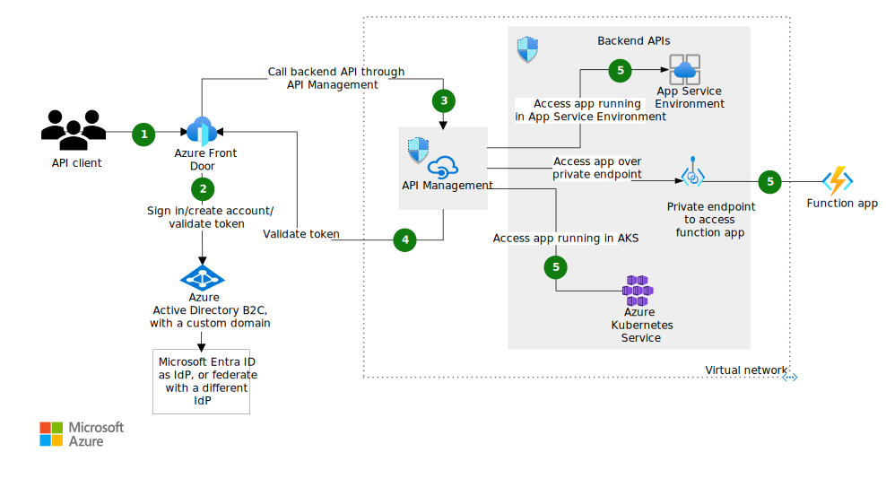

# 요구사항

* 글로벌 고객을 대상으로 서비스를 진행하고자 하며 전 세계 사용자에게 빠르게 서비스를 제공할 수 있도록 구성되어야 한다.

# 1. APIM 및 Front Door Archi

Azure API Management와 Azure Front Door를 활용하여 FrontEnd를 구성하는 아키텍처는 글로벌 분산된 사용자에게 빠르고 안전한 API 서비스를 제공하기 위한 강력한 아키텍처를 구축할 수 있습니다. 다음은 이 두 가지 서비스를 사용하여 FrontEnd 아키텍처를 설계하는 방법입니다.

### 1. **아키텍처 개요**

이 아키텍처는 Azure Front Door를 사용하여 전 세계적으로 분산된 사용자에게 빠른 콘텐츠 전달과 부하 분산을 제공하며, Azure API Management를 통해 API 게이트웨이 기능을 제공합니다. 이 아키텍처는 높은 가용성, 보안, 성능을 보장하면서도 API 트래픽을 효율적으로 관리할 수 있습니다.

### 2. **구성 요소**

1. **Azure Front Door**
   - **역할**: 전 세계적으로 사용자에게 가장 가까운 Azure PoP(Point of Presence)에서 트래픽을 받아 백엔드로 라우팅. 프론트엔드와 API 트래픽에 대한 글로벌 부하 분산 및 속도 향상.
   - **기능**:
     - 글로벌 HTTP/HTTPS 부하 분산
     - SSL/TLS 종료
     - URL 기반 라우팅
     - 캐싱 및 가속화
     - WAF(Web Application Firewall) 통합 가능

2. **Azure API Management (APIM)**
   - **역할**: API 요청을 수집하여 적절한 백엔드 서비스로 라우팅하고, 보안, 인증, 모니터링 등의 기능을 제공하는 API 게이트웨이.
   - **기능**:
     - API 게이트웨이 역할 (API 요청 라우팅, 프로토콜 변환 등)
     - 인증 및 권한 부여 (OAuth2, JWT, 기본 인증 등)
     - API 분석 및 모니터링
     - API 버전 관리 및 수명 주기 관리
     - 개발자 포털 제공

3. **백엔드 서비스**
   - **Azure App Service / Azure Kubernetes Service (AKS)**
     - 프론트엔드 애플리케이션 및 API를 호스팅합니다. Spring Boot와 같은 백엔드 애플리케이션이 배포될 수 있습니다.
   - **Azure SQL Database / Cosmos DB**
     - API가 사용하는 데이터베이스 서비스로, 고가용성과 성능을 보장합니다.
   - **Azure Functions / Logic Apps**
     - 서버리스로 운영되는 비즈니스 로직을 처리할 수 있습니다. 이벤트 기반 트리거를 통해 다양한 작업을 수행합니다.

### 3. **아키텍처 흐름**

1. **사용자 요청**:
   - 사용자가 웹 브라우저 또는 모바일 앱을 통해 `https://frontend.contoso.com` 또는 `https://api.contoso.com` 같은 도메인으로 요청을 보냅니다.

2. **Azure Front Door**:
   - Azure Front Door는 사용자에게 가장 가까운 Azure의 PoP에서 요청을 받아, 전 세계적으로 최적의 경로를 통해 트래픽을 라우팅합니다.
   - 요청된 도메인 및 URL 경로에 따라 트래픽을 분산시킵니다.
     - 정적 콘텐츠는 Azure Storage 또는 Azure Static Web Apps에서 제공되며, 캐싱을 통해 성능이 최적화됩니다.
     - API 요청은 Azure API Management로 전달됩니다.

3. **Azure API Management**:
   - Azure Front Door에서 전달된 API 요청을 받아 필요한 인증 및 정책을 적용합니다.
   - API Management는 요청을 적절한 백엔드 서비스(예: Azure App Service, AKS, Functions 등)로 라우팅합니다.
   - 백엔드 서비스에서 처리된 응답을 받아 클라이언트에게 반환합니다.
   - API Management는 또한 API 호출에 대한 로깅 및 모니터링을 수행하며, 필요 시 개발자 포털을 통해 API를 관리할 수 있습니다.

4. **백엔드 서비스**:
   - API Management에서 전달된 요청을 백엔드 서비스(Azure App Service, AKS, Functions 등)가 처리합니다.
   - 백엔드 서비스는 필요 시 데이터베이스(Azure SQL, Cosmos DB)와 통신하여 필요한 데이터를 조회하거나 저장합니다.
   - 처리된 결과를 API Management로 반환합니다.

5. **Azure Front Door**:
   - Azure Front Door는 최종적으로 응답을 클라이언트에게 반환합니다.
   - 웹 애플리케이션이 정적 자산을 요청하는 경우, Front Door는 이를 캐싱하여 빠르게 반환합니다.

### 4. **보안 및 최적화**

- **SSL/TLS 암호화**: Azure Front Door는 SSL/TLS 암호화를 종료하며, 사용자와 Azure Front Door 간의 모든 트래픽이 안전하게 전송됩니다.
- **웹 애플리케이션 방화벽 (WAF)**: Azure Front Door에 WAF를 통합하여 DDoS 공격, SQL 인젝션, 크로스 사이트 스크립팅(XSS) 등의 웹 애플리케이션 공격으로부터 애플리케이션을 보호할 수 있습니다.
- **API 보호**: Azure API Management는 인증 및 권한 부여를 통해 API를 보호하며, 각 요청에 대해 API 키, OAuth2, JWT 등을 사용할 수 있습니다.
- **로깅 및 모니터링**: API 호출 및 프론트엔드 요청에 대한 로그와 모니터링을 Azure Monitor와 Log Analytics를 통해 수행합니다.

### 5. **아키텍처 다이어그램**

1. **Azure Front Door**
   - 사용자의 요청을 전 세계 PoP를 통해 수신하고, 백엔드로 라우팅.
   - 정적 콘텐츠 캐싱 및 SSL 종료.

2. **Azure API Management**
   - API 요청을 수신하고, 정책 적용 후 백엔드 서비스로 전달.
   - 인증, 로깅, 모니터링, 개발자 포털 제공.

3. **백엔드 서비스**
   - Azure App Service, AKS, Functions 등에서 API 및 애플리케이션 로직 처리.
   - 데이터베이스 통신 및 서버리스 처리.

4. **데이터베이스**
   - Azure SQL Database, Cosmos DB 등에서 데이터를 저장 및 조회.

### 결론

이 아키텍처는 Azure Front Door와 Azure API Management를 결합하여 전 세계적으로 분산된 사용자에게 빠르고 안전한 API 서비스를 제공할 수 있도록 설계되었습니다. Azure Front Door는 트래픽을 글로벌하게 분산하고 가속화하며, Azure API Management는 API의 보안 및 관리 기능을 담당합니다. 이 아키텍처는 높은 성능, 보안, 확장성을 보장하면서도, API 및 웹 애플리케이션의 관리를 효율적으로 수행할 수 있도록 지원합니다.

# 2. 구성도

참조링크 : https://learn.microsoft.com/ko-kr/azure/architecture/solution-ideas/articles/protect-backend-apis-azure-management

