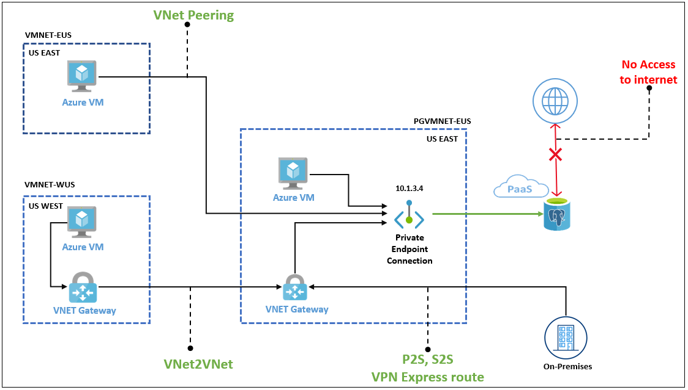

# 1. Azure postgresql  단일지역 고가용성

## 1) 기본 아키텍처

#### 1. **기본 구성 요소**

1. **Azure Database for PostgreSQL - Flexible Server**:
   - **고가용성 모드**: Flexible Server는 단일 리전 내에서 가용성 영역(Availability Zone)을 선택하여 고가용성을 보장합니다. 
   - **자동 장애 조치(Failover)**: 기본 인스턴스에 문제가 발생하면, 자동으로 예비 인스턴스로 장애 조치를 수행합니다.
   - **읽기 복제본(Read Replicas)**: 읽기 작업 부하를 분산하기 위해 복제본을 설정하여 고가용성을 높입니다.

2. **Application Layer (AKS or Virtual Machines)**:
   - **데이터베이스 연결**: 애플리케이션은 Azure PostgreSQL Flexible Server에 연결되며, 자동 장애 조치 시 연결이 유지됩니다.
   - **로컬 캐싱 전략**: 읽기 성능을 향상시키기 위해 Azure Redis Cache를 사용할 수 있습니다.

3. **Azure Load Balancer (Optional)**:
   - **트래픽 분산**: 여러 애플리케이션 인스턴스에 대한 트래픽을 균등하게 분산하여 애플리케이션의 고가용성을 유지합니다.

#### 2. **트래픽 흐름**

1. **고가용성 연결**:
   - 애플리케이션은 데이터베이스의 읽기 복제본과 기본 인스턴스 간의 트래픽을 자동으로 라우팅하여 고가용성을 유지합니다.

2. **장애 조치**:
   - 주 데이터베이스 인스턴스에 장애가 발생할 경우, Azure PostgreSQL Flexible Server는 자동으로 장애 조치를 수행하여 다운타임을 최소화합니다.

#### 3. **장점**

- **높은 가용성**: 단일 리전 내에서도 여러 가용성 영역을 활용하여 데이터베이스의 고가용성을 유지할 수 있습니다.
- **자동 장애 조치**: 시스템 장애 시 자동으로 복구되며, 운영 중단을 최소화합니다.
- **확장성**: 필요에 따라 읽기 복제본을 추가하여 확장할 수 있습니다.

이 아키텍처는 단일 리전 내에서 고가용성을 유지하며, 성능과 보안을 최적화하는 데 적합합니다.

## 2) 고가용성 방법

Azure Database for PostgreSQL에서는 단일 지역 내에서도 고가용성을 위해 **고가용성(HA) 모드**를 제공하며, 이는 기본적으로 **Zone-Redundant HA**와 **Same-Zone HA** 두 가지 방식으로 구현됩니다:

1. **Zone-Redundant HA**:
   - 데이터베이스 인스턴스와 복제본이 서로 다른 가용성 영역(Availability Zone)에 위치하여, 한 영역에서 장애가 발생해도 서비스 가용성을 유지합니다.

2. **Same-Zone HA**:
   - 동일한 가용성 영역 내에서 자동 복제본을 생성하여 가용성을 유지합니다. 단일 영역 내에서도 데이터베이스가 중단 없이 운영될 수 있도록 복제됩니다.

이러한 HA 모드에서는 **동기 복제**를 사용하여 데이터 무결성을 유지하고, 필요 시 **자동 장애 조치(Failover)**를 수행합니다. Geo-Replication과는 달리, 단일 지역 내에서의 복제는 리전 간 복제가 아닌 동일 리전 내에서의 고가용성을 보장하기 위한 것입니다.

## 3) Private Endpoint 설계

1. **단일 엔드포인트**:
   - **설계**: 고가용성을 위해 Zone-Redundant HA 모드에서 사용됩니다. 클라이언트는 단일 엔드포인트를 사용하며, 이 엔드포인트는 자동으로 활성화된 데이터베이스 인스턴스에 연결됩니다.
   - **장점**: 단순한 관리 및 자동 장애 조치(Failover) 시에도 동일한 엔드포인트를 사용할 수 있어 애플리케이션 코드 변경이 필요하지 않습니다.

2. **N개 엔드포인트**:
   - **설계**: 각각의 가용성 영역에 대한 별도의 엔드포인트를 설정할 수 있습니다. 그러나 이 접근 방식은 복잡성을 증가시킵니다.
   - **RW 작업**: 읽기 작업(Read)은 각 영역의 복제본에서 수행할 수 있지만, 쓰기 작업(Write)은 항상 주 인스턴스에서만 수행해야 합니다. 그렇지 않으면 데이터 일관성 문제가 발생할 수 있습니다.

## 4) [참고] Private Endpoint vs. Private Link

- **Private Endpoint**:
  - **용도**: Azure Database for PostgreSQL과 같은 서비스에 대해 VNet 내부에서 안전하게 접근할 수 있도록 설정합니다.
  - **적용**: 일반적으로 Private Endpoint를 사용해 데이터베이스와의 안전한 통신을 구성합니다.

- **Private Link**:
  - **용도**: 다양한 Azure 서비스를 안전하게 VNet 내부에서 연결하는 더 일반적인 네트워킹 옵션입니다.
  - **적용**: Private Endpoint는 Private Link의 특정 구현으로, Azure Database for PostgreSQL에서는 Private Endpoint를 사용하여 설정합니다.

#### 결론

- **단일 엔드포인트**가 고가용성 설정에서 가장 일반적이며, 복잡성을 줄이는 데 유리합니다.
- **Private Endpoint**를 사용하여 안전한 네트워크 통신을 설정하는 것이 일반적입니다.

#  2. 구성도

## 1) PE DB

참고링크 : https://learn.microsoft.com/en-us/azure/postgresql/flexible-server/concepts-networking-private-link

## 2) zone-redundant HA DB

참고링크 : https://learn.microsoft.com/en-us/azure/reliability/reliability-postgresql-flexible-server

