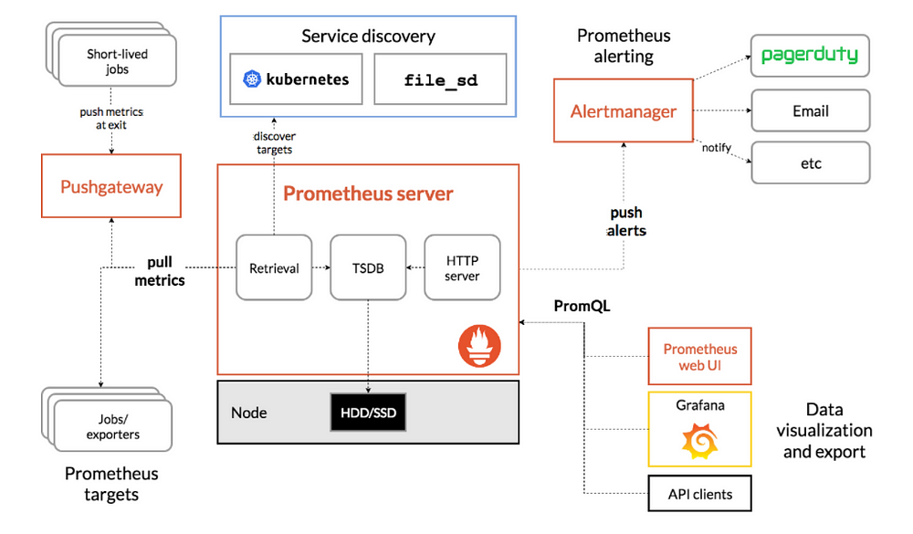
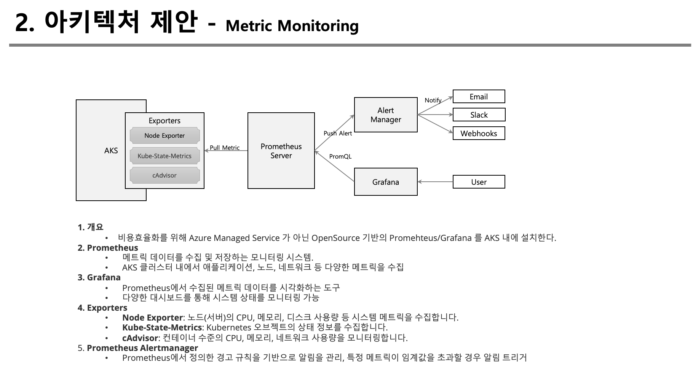

# 요구사항

* AKS 의 CPU,Memtory, Disk 등의 리소스 Metric을 효율적으로 관리할 수 있어야 한다. 

# 1. 아키텍처

### AKS 기반 Metric Monitoring 아키텍처 설계

#### 1. **아키텍처 구성 요소**

1. **Prometheus**:
   - **역할**: 메트릭 데이터를 수집 및 저장하는 모니터링 시스템입니다. AKS 클러스터 내에서 애플리케이션, 노드, 네트워크 등 다양한 메트릭을 수집합니다.
   - **배포**: Kubernetes 클러스터 내에 Prometheus 서버를 배포하여 메트릭을 수집합니다.

2. **Grafana**:
   - **역할**: Prometheus에서 수집된 메트릭 데이터를 시각화하는 도구입니다. 다양한 대시보드를 통해 시스템 상태를 모니터링할 수 있습니다.
   - **배포**: AKS 클러스터 내에 Grafana를 배포하고 Prometheus와 연결합니다.

3. **Exporters**:
   - **Node Exporter**: 노드(서버)의 CPU, 메모리, 디스크 사용량 등 시스템 메트릭을 수집합니다.
   - **Kube-State-Metrics**: Kubernetes 오브젝트의 상태 정보를 수집합니다.
   - **cAdvisor**: 컨테이너 수준의 CPU, 메모리, 네트워크 사용량을 모니터링합니다.
   - **Azure Monitor Exporter**: Azure Monitor에서 수집된 메트릭을 Prometheus에 노출합니다.

#### 2. **Alerting (알림)**

1. **Prometheus Alertmanager**:
   - **역할**: Prometheus에서 정의한 경고 규칙을 기반으로 알림을 관리합니다.
   - **구성**: 알림 규칙을 정의하여 특정 메트릭이 임계값을 초과할 경우 알림을 트리거합니다.

2. **Alert 설정 예시**:
   - **CPU 사용률 경고**: 특정 노드에서 CPU 사용률이 80%를 초과하면 경고 알림을 발생시킵니다.
   - **Pod 상태 경고**: 특정 Pod가 CrashLoopBackOff 상태에 있을 경우 알림을 보냅니다.

3. **Alert Notification**:
   - **Slack, Email, Webhooks**: Alertmanager를 통해 알림을 Slack, 이메일 또는 특정 웹훅으로 전송할 수 있습니다.

### 요약

이 아키텍처는 Azure AKS에서 Prometheus와 Grafana를 활용한 메트릭 모니터링 시스템을 설계합니다. Prometheus가 메트릭을 수집하고, Grafana가 이를 시각화하며, Alertmanager를 통해 특정 조건에서 경고 알림을 트리거하여 운영 중 문제가 발생할 경우 즉시 대응할 수 있도록 구성합니다.

# 2.  구성도

참고링크 : https://medium.com/hungry-devops/prometheus-uncovered-basics-and-beyond-df8b3d2a6746

# 3. PPT

