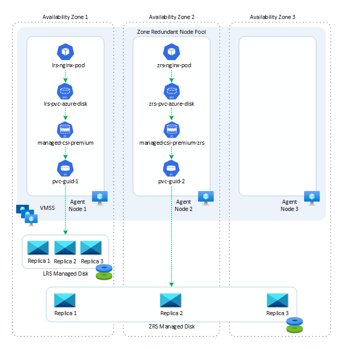
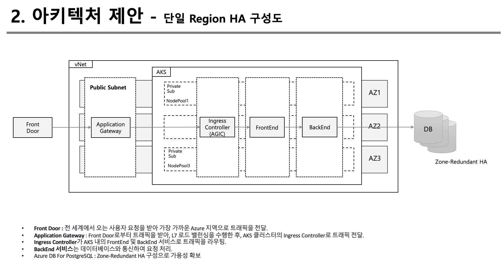
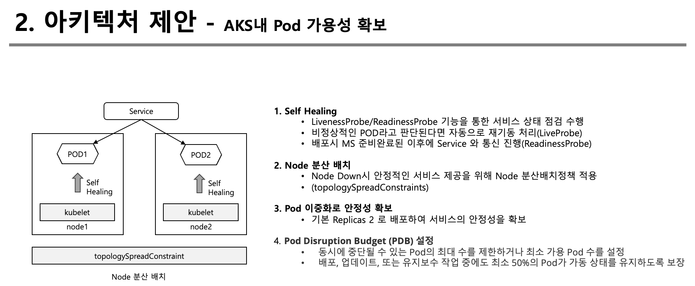
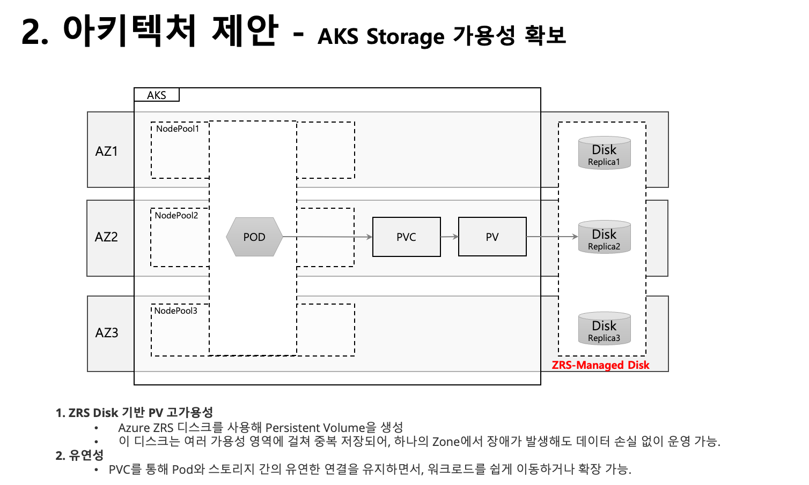

# 요구사항

* 장애나 배포 등의 상황에서도 서비스는 항상 50% 이상의 가용성을 유지해야 한다.

# 1. 고가용성 보장을 위한 AKS 기반 아키텍처

## 1) 구성요소

#### 1. **클러스터 가용성 (NodePool 관점)**:

1. **다중 Node Pool 구성**:
   - **설정**: AKS 클러스터를 구성할 때 최소 2개의 Node Pool을 사용합니다.
   - **목적**: 각 Node Pool은 서로 다른 Azure Availability Zone에 배포되어 단일 장애 지점(Single Point of Failure)을 방지합니다.
   - **운영 중단 방지**: 한 Node Pool이 장애가 발생하거나 유지보수로 인해 중단되더라도, 다른 Node Pool에서 최소 50% 이상의 서비스를 유지할 수 있습니다.

2. **Pod 안티어피니티 (Pod Anti-Affinity)**:
   - **설정**: Pod가 동일한 Node Pool 내의 동일한 노드에 과도하게 스케줄링되지 않도록 보장하여 분산을 촉진합니다.
   - **목적**: 특정 노드에 의존하지 않도록 하여, 노드 장애 시 서비스의 영향을 최소화합니다.

3. **Topology Spread Constraints**:
   * **설정**: Pod가 클러스터 내에서 균등하게 분포되도록 제한합니다.
   * 목적: 장애 도메인(예: Availability Zone) 내에서 균등한 Pod 분포를 보장하여 가용성 유지.

#### 2. **POD 가용성 (HPA 관점)**:

1. **Horizontal Pod Autoscaler (HPA) 설정**:
   - **설정**: HPA를 사용하여 Pod의 수를 자동으로 조정합니다. CPU 사용률, 메모리 사용률, 사용자 정의 메트릭(예: 응답 시간) 등을 기준으로 확장 또는 축소합니다.
   - **목적**: 트래픽 증가나 리소스 부족 시 자동으로 Pod 수를 확장하여 가용성을 유지합니다.

2. **Pod Disruption Budget (PDB) 설정**:
   - **설정**: PDB를 사용하여 동시에 중단될 수 있는 Pod의 최대 수를 제한하거나 최소 가용 Pod 수를 설정합니다.
   - **목적**: 배포, 업데이트, 또는 유지보수 작업 중에도 최소 50%의 Pod가 가동 상태를 유지하도록 보장합니다.

#### [참고] PBD

**Pod Disruption Budget (PDB)**는 Kubernetes에서 파드의 가용성을 관리하기 위한 설정입니다. PDB는 클러스터에서 발생할 수 있는 유지보수 작업(예: 노드 업그레이드, 파드 재배치)이나 장애 상황에서도 애플리케이션의 가용성을 유지하도록 돕습니다. PDB는 두 가지 주요 설정을 제공합니다:

​	1.**minAvailable**: 최소 가용한 파드의 수 또는 비율을 설정합니다. 이 값 이하로 파드가 줄어들지 않도록 보장합니다.

​	2.**maxUnavailable**: 동시에 중단될 수 있는 파드의 최대 수 또는 비율을 설정합니다.

PDB는 클러스터 내에서 안전한 파드 중단을 관리하여 서비스 가용성을 유지하는 데 중요한 역할을 합니다.

#### 3. **배포 전략**:

1. **Rolling Update 전략**:
   - **설정**: 배포 시 Rolling Update 전략을 사용하여 점진적으로 Pod를 교체합니다.
   - **목적**: 새로운 버전의 애플리케이션을 배포할 때, 전체 Pod가 중단되는 상황을 방지하고 항상 최소 50% 이상의 Pod가 가용하도록 합니다.

2. **Canary 배포**:
   - **설정**: 새로운 버전의 애플리케이션을 일부 사용자에게만 먼저 배포하여 검증 후 전체 배포를 진행합니다.
   - **목적**: 배포 중 발생할 수 있는 이슈를 최소화하고 서비스 중단 없이 점진적으로 업데이트를 적용합니다.

### 요약:

이 아키텍처는 AKS에서 Node Pool의 다중화와 Pod의 자동 확장 및 분산을 통해 클러스터와 애플리케이션의 고가용성을 보장합니다. 장애나 배포 상황에서도 최소 50% 이상의 서비스 가용성을 유지할 수 있도록 설계되었습니다.

# 2. AKS Storage HA 

## 1) 아키텍처

### AKS Storage 가용성 아키텍처 설계 (ZRS 활용)

#### 1. **구성 요소 및 개요**
   - **AKS Cluster**: 애플리케이션을 호스팅하는 Kubernetes 클러스터.
   - **Persistent Volume (PV)**: Azure Disk를 기반으로 하는 영구 스토리지 볼륨.
   - **Persistent Volume Claim (PVC)**: Pod에서 사용하는 스토리지 요청.
   - **Azure Disk (ZRS)**: Zone-Redundant Storage를 사용하는 디스크로, 가용성 영역(Availability Zone) 간에 중복 저장됨.

#### 2. **아키텍처 설계**

1. **AZ 기반 Node Pools**:
   - 각 가용성 영역(예: Zone 1, Zone 2, Zone 3)에 걸쳐 Node Pool을 배치하여, 워크로드가 특정 가용성 영역에 종속되지 않도록 구성.

2. **ZRS 디스크 기반 PV**:
   - Azure ZRS 디스크를 사용해 Persistent Volume을 생성하고, 이를 AKS에서 PV로 마운트하여 사용. 이 디스크는 여러 가용성 영역에 걸쳐 중복 저장되어, 하나의 Zone에서 장애가 발생해도 데이터 손실 없이 운영 가능.

3. **PVC 관리**:
   - 각 워크로드(애플리케이션)는 해당 PVC를 통해 ZRS 디스크를 사용. PVC는 특정 가용성 영역에 구속되지 않고, 어느 Zone에서도 동일한 데이터를 접근 가능.

4. **Pod 배포**:
   - 동일한 워크로드를 여러 Zone에 걸쳐 분산 배치하여, 특정 Zone에서 장애가 발생해도 다른 Zone의 Pod에서 지속적인 서비스가 가능하도록 구성.

5. **AZ 기반 확장성**:
   - 트래픽 증가 시 각 가용성 영역의 노드를 자동으로 확장(또는 축소)할 수 있는 기능을 사용하여, 고가용성을 유지하면서 비용을 최적화.

#### 3. **장점**
   - **고가용성**: ZRS 디스크를 활용한 데이터 중복성과 여러 Zone에 걸친 노드 배치를 통해, 시스템 전체의 고가용성을 보장.
   - **데이터 보호**: ZRS 디스크를 통해 데이터가 다중 영역에 복제되어, 물리적 장애로 인한 데이터 손실을 방지.
   - **유연성**: PVC를 통해 Pod와 스토리지 간의 유연한 연결을 유지하면서, 워크로드를 쉽게 이동하거나 확장 가능.

이 아키텍처는 AKS 클러스터에서 ZRS 기반의 스토리지를 사용하여 고가용성 및 데이터 보호를 보장하며, 가용성 영역 간에 안정적인 워크로드 배포를 제공합니다.

## 2) 구성도(Storage HA)

참고링크 : https://techcommunity.microsoft.com/t5/fasttrack-for-azure/a-practical-guide-to-zone-redundant-aks-clusters-and-storage/ba-p/4036254

# 3. PPT

