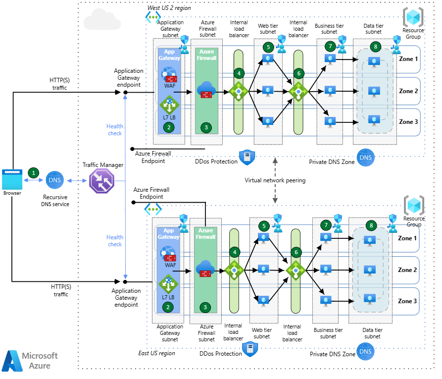

# Multi-region load balancing 

> Multi-region load balancing with Traffic Manager, Azure Firewall, and Application Gateway

### Azure Multi-Region 아키텍처 설계

#### 1. **아키텍처 구성 요소**

1. **Azure Traffic Manager**:
   - **역할**: 글로벌 부하 분산 서비스로, 사용자 요청을 가장 가까운 Azure 리전의 Application Gateway로 라우팅합니다.
   - **라우팅 방법**: 성능 기반, 우선순위, 가중치 등의 라우팅 방법을 지원하여 최적의 리전에 트래픽을 분배합니다.

2. **Azure Application Gateway**:
   - **역할**: 각 리전에서 HTTP/HTTPS 트래픽을 처리하는 L7(애플리케이션 계층) 로드 밸런서입니다.
   - **기능**: SSL 종료, 웹 애플리케이션 방화벽(WAF), 트래픽 라우팅 등을 통해 애플리케이션의 보안과 성능을 보장합니다.
   - **배치**: 각 리전마다 하나의 Application Gateway를 배포하여 로컬 트래픽을 처리합니다.

3. **Azure Firewall**:
   - **역할**: 네트워크 계층에서 트래픽을 필터링하여 악성 트래픽을 차단하고, 네트워크 보안을 강화합니다.
   - **통합**: Application Gateway 앞단에 배치하여 모든 인바운드 트래픽을 검사한 후, 허용된 트래픽만 Application Gateway로 전달합니다.
   - **배치**: 각 리전의 VNet에 Azure Firewall을 배치하여 보안을 강화합니다.

#### 2. **트래픽 흐름**

1. **글로벌 트래픽 라우팅**:
   - 사용자 요청이 발생하면 **Azure Traffic Manager**가 가장 가까운 Azure 리전으로 트래픽을 라우팅합니다.

2. **보안 검사 및 라우팅**:
   - **Azure Firewall**은 각 리전에서 수신된 트래픽을 검사하고, 허용된 트래픽만 **Application Gateway**로 전달합니다.

3. **애플리케이션 처리**:
   - **Application Gateway**는 SSL 종료 및 로드 밸런싱을 수행하여, AKS 또는 백엔드 서비스로 트래픽을 전달합니다.

4. **데이터 및 상태 관리**:
   - 데이터베이스와 애플리케이션 상태는 여러 리전에 걸쳐 복제되어, 장애 발생 시에도 높은 가용성을 보장합니다.

#### 3. **장점**
- **글로벌 가용성**: Traffic Manager를 통해 여러 리전에 걸쳐 높은 가용성과 성능을 제공합니다.
- **보안 강화**: Azure Firewall과 Application Gateway의 조합으로 강력한 보안과 성능을 유지합니다.
- **유연한 확장성**: 각 리전의 Application Gateway와 Azure Firewall이 독립적으로 확장 가능합니다.

이 아키텍처는 Azure의 고급 서비스들을 결합하여 글로벌 수준의 고가용성, 보안, 그리고 성능을 보장하는 솔루션을 제공합니다.

