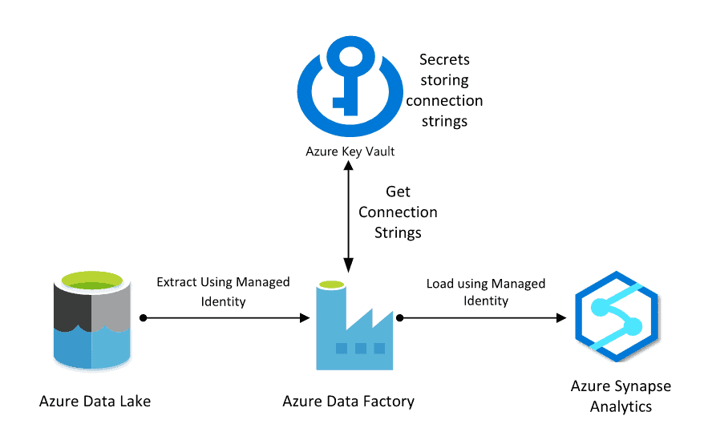

# 요구사항

* Azure Key Vault 를 이용한 Azure 보안관리

# 1. Azure Database 사례 

Azure Key Vault와 Azure Database 간의 연결 아키텍처는 보안 및 관리 효율성을 높이기 위해 설계됩니다. 다음은 이 아키텍처에 대한 설명입니다:

### 1. **Azure Key Vault**:
   - **역할**: 애플리케이션에서 사용하는 비밀값, 인증서, 암호화 키 등을 안전하게 저장하고 관리합니다.
   - **기능**: 암호화 키를 안전하게 저장하고 관리하며, 데이터베이스 연결 문자열 등의 비밀값을 보호합니다.

### 2. **Azure Database**:
   - **역할**: 애플리케이션의 데이터 저장소로 사용됩니다. Azure SQL Database, Cosmos DB, MySQL, PostgreSQL 등의 서비스가 포함됩니다.

### 3. **아키텍처 설명**:

1. **비밀값 저장**:
   - 데이터베이스 연결 문자열, 암호화 키 등의 민감한 정보는 Azure Key Vault에 저장됩니다.

2. **애플리케이션 통합**:
   - 애플리케이션은 Azure Managed Identity 또는 서비스 주체를 사용하여 Key Vault에 접근하고, 데이터베이스 연결 정보를 안전하게 가져옵니다.

3. **데이터베이스 연결**:
   - 애플리케이션은 Key Vault에서 가져온 연결 문자열을 사용하여 Azure Database에 안전하게 연결합니다.
   - Key Vault의 접근 제어는 Azure Active Directory (AAD)를 통해 관리됩니다.

4. **보안 강화**:
   - Key Vault에 저장된 데이터는 Azure Key Vault의 암호화 기능을 통해 보호됩니다.
   - 애플리케이션의 연결 문자열은 코드나 구성 파일에 하드코딩되지 않고 Key Vault에서 동적으로 가져옵니다.

### 4. **장점**:
   - **보안**: 민감한 데이터가 안전하게 저장되고, 연결 문자열의 노출 위험이 줄어듭니다.
   - **관리 편의성**: 중앙 집중식으로 비밀값과 인증서를 관리할 수 있습니다.
   - **확장성**: 여러 애플리케이션이나 서비스에서 Key Vault를 활용할 수 있어 확장성이 뛰어납니다.

이 아키텍처는 클라우드 환경에서 보안과 관리의 효율성을 높이는 데 매우 유용합니다.

# 2. Azure Data Factory 사례

Azure Key Vault와 Azure Data Factory의 아키텍처는 민감한 데이터의 안전한 처리를 위해 설계됩니다. 아래는 이 두 서비스가 어떻게 통합되어 작동하는지에 대한 설명입니다.

### 아키텍처 구성 요소:

1. **Azure Key Vault**:
   - **역할**: Azure Key Vault는 데이터베이스 연결 문자열, API 키, 암호화 키 등 민감한 비밀값을 안전하게 저장하고 관리합니다.
   - **사용 사례**: Azure Data Factory에서 데이터 처리 작업 시 필요한 비밀값을 안전하게 관리하기 위해 사용됩니다.

2. **Azure Data Factory**:
   - **역할**: Azure Data Factory는 클라우드에서 데이터 통합 서비스로, 데이터 이동, 변환, 스케줄링 작업을 자동화합니다.
   - **통합**: 데이터 소스와 대상 간에 데이터를 이동하거나 변환할 때, 민감한 정보를 직접 저장하지 않고 Key Vault에서 필요 시 가져옵니다.

### 동작 흐름:

1. **비밀값 저장**:
   - 데이터베이스 연결 문자열, API 키 등의 민감한 정보는 Azure Key Vault에 저장됩니다.

2. **Data Factory 통합**:
   - Azure Data Factory는 데이터 이동 및 변환 작업을 수행할 때, Managed Identity 또는 서비스 주체를 통해 Azure Key Vault에 접근하여 필요한 비밀값을 가져옵니다.

3. **데이터 처리**:
   - Azure Data Factory는 Key Vault에서 가져온 비밀값을 사용하여 데이터 소스에 연결하고, 데이터를 이동하거나 변환합니다.

4. **보안 및 관리**:
   - 비밀값은 Azure Data Factory의 파이프라인 코드나 구성 파일에 노출되지 않으며, Key Vault에서 안전하게 관리됩니다.
   - Azure Active Directory(AAD)를 통해 Key Vault에 대한 접근 권한이 관리됩니다.

### 장점:

- **보안 강화**: 민감한 데이터가 코드나 구성 파일에 노출되지 않고 Key Vault에서 안전하게 관리됩니다.
- **중앙 관리**: 비밀값을 중앙에서 관리하고, 필요 시 업데이트할 수 있습니다.
- **확장성**: 여러 데이터 처리 파이프라인에서 Key Vault를 활용할 수 있어 확장성이 뛰어납니다.

이 아키텍처는 클라우드 환경에서 민감한 데이터를 안전하게 처리하고 관리할 수 있는 강력한 방법을 제공합니다.